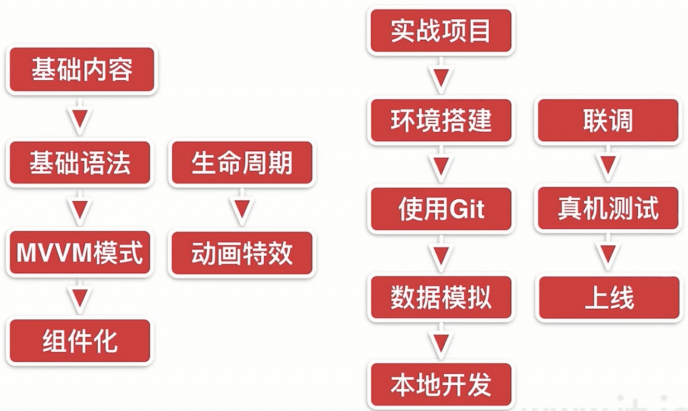
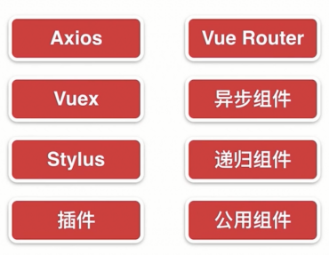
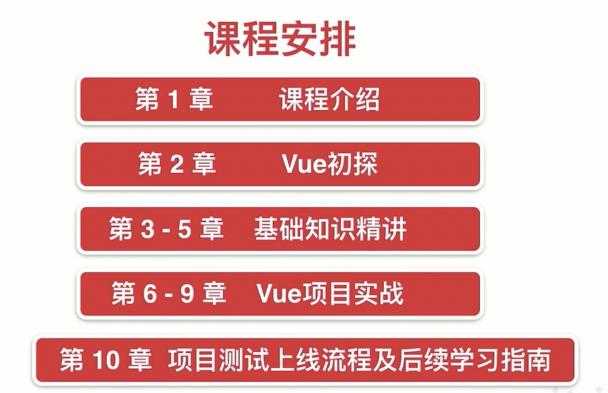
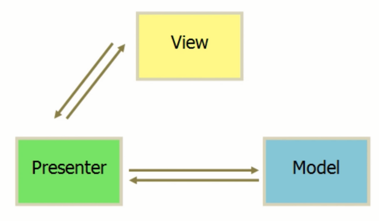

Vue2.5从零基础入门到实战项目开发去哪儿网App
# 第1章 课程介绍
	本章主要介绍课程的知识大纲，学习前提，讲授方式及预期收获。
## 1-1 课程简介

### 课程流程



### 知识点



### 课程安排



### 学习前提


### 讲授方式

1. 通俗易懂的案例讲解
2. 借助基础知识实现项目
3. 带着你编写每一行代码
4. 图文讲解复杂知识点

### 课程收获

1. 彻底入门Vue的使用
2. 理解整个Vue项目的开发流程
3. 移动端页面布局技巧
4. 上手中型Vue项目的开发
5. 规范的代码编写


# 第2章 Vue 起步
	本章将快速讲解部分 Vue 基础语法，通过 TodoList 功能的编写，
	在熟悉基础语法的基础上，扩展解析 MVVM 模式及前端组件化的概念及优势。
## 2-1 课程学习方法
> 官方文档:
>
> https://cn.vuejs.org/v2/guide/

- 基于官方文档
  - 视频学习后看官方文档

## 2-2 hello world

```html
<!DOCTYPE html>
<html lang="en">

<head>
  <meta charset="UTF-8">
  <meta name="viewport" content="width=device-width, initial-scale=1.0">
  <meta http-equiv="X-UA-Compatible" content="ie=edge">
  <title>Hello world</title>
  <script src="./vue.js"></script>
</head>

<body>
  <div id="app">{{content}}</div>
  <div>{{content}}</div>
  <script>
    // document.getElementById('app').innerHTML = 'Hello world'
    var app = new Vue({
      el: '#app',
      data: {
        content: 'Hello world'
      }
    })
    setTimeout(function () {
      app.$data.content = 'hi bye'
    }, 1000)
  </script>
</body>

</html>
```


## 2-3 开发TodoList（v-model、v-for、v-on）

```html
<!DOCTYPE html>
<html lang="en">

<head>
  <meta charset="UTF-8">
  <meta name="viewport" content="width=device-width, initial-scale=1.0">
  <meta http-equiv="X-UA-Compatible" content="ie=edge">
  <title>TodoList</title>
  <script src="./vue.js"></script>
</head>

<body>
  <div id="app">
    <input type="text" v-model="inputValue">
    <button v-on:click="handleBtnClick">提交</button>
    <ul>
      <li v-for="item in list">{{item}}</li>
    </ul>
  </div>
  <script>
    var app = new Vue({
      el: '#app',
      data: {
        list: ['第一课的内容', '第二课的内容'],
        inputValue: ''
      },
      methods: {
        handleBtnClick() {
          this.$data.list.unshift(this.inputValue)
          this.inputValue = ''
        }
      },
    })
  </script>
</body>

</html>
```


## 2-4 MVVM模式

**传统的 MVP 设计模式**

- Model : 数据层
- Presenter : 呈现层, 业务逻辑
- View : 视图层, DOM 展示



- 实例: 

  - 80% 代码在操作 DOM

  ```html
  <!DOCTYPE html>
  <html lang="en">
  
  <head>
    <meta charset="UTF-8">
    <meta name="viewport" content="width=device-width, initial-scale=1.0">
    <meta http-equiv="X-UA-Compatible" content="ie=edge">
    <title>TodoList JQuery</title>
    <script src="./jquery1.12.4.js"></script>
  </head>
  
  <body>
    <div id="app">
      <input type="text" id="input">
      <button id="btn">提交</button>
      <ul id="list"></ul>
    </div>
    <script>
      // M (模型层) V 视图 P(控制器)
      function Page() {
  
      }
      $.extend(Page.prototype, {
        init: function () {
          this.bindEvents()
        },
        bindEvents: function () {
          var btn = $('#btn')
          btn.on('click', $.proxy(this.handleBtnClick, this))
        },
        handleBtnClick: function () {
          var inputElm = $("#input")
          var inputValue = inputElm.val()
          var ulElem = $("#list")
          ulElem.append('<li>' + inputValue + '</li>')
          inputElm.val('')
        }
      })
  
      var page = new Page()
      page.init()
    </script>
  </body>
  
  </html>
  ```

  

**MVVM 设计模式**


- 只要操作 Model 层和 View 层
- Vue 自动帮我们操作 ViewModel 层
  - 通过 Object.defineProperties 和 虚拟 DOM 实现

## 2-5 前端组件化

- 每个组件就是页面的一个区域

## 2-6 使用组件改造TodoList

```HTML
<!DOCTYPE html>
<html lang="en">

<head>
  <meta charset="UTF-8">
  <meta name="viewport" content="width=device-width, initial-scale=1.0">
  <meta http-equiv="X-UA-Compatible" content="ie=edge">
  <title>TodoList</title>
  <script src="./vue.js"></script>
</head>

<body>
  <div id="app">
    <input type="text" v-model="inputValue">
    <button v-on:click="handleBtnClick">提交</button>
    <ul>
      <!-- <li v-for="item in list">{{item}}</li> -->
      <todo-item v-bind:content="item" v-for="item in list">
      </todo-item>
    </ul>
  </div>
  <script>
    // // 全局组件
    // Vue.component("TodoItem", {
    //   props: ['content'], // 接收 v-bind:content 传递的值
    //   template: "<li>{{content}}</li>" // 模板内使用字符串
    // })

    var TodoItem = {
      props: ['content'],
      template: "<li>{{content}}</li>"
    }

    var app = new Vue({
      el: '#app',
      components: {
        TodoItem: TodoItem // 注册局部组件
      },
      data: {
        list: ['第一课的内容', '第二课的内容'],
        inputValue: ''
      },
      methods: {
        handleBtnClick() {
          this.$data.list.unshift(this.inputValue)
          this.inputValue = ''
        }
      },
    })
  </script>

</body>

</html>
```


## 2-7 简单的组件间传值

```HTMl
<!DOCTYPE html>
<html lang="en">

<head>
  <meta charset="UTF-8">
  <meta name="viewport" content="width=device-width, initial-scale=1.0">
  <meta http-equiv="X-UA-Compatible" content="ie=edge">
  <title>TodoList</title>
  <script src="./vue.js"></script>
</head>

<body>
  <div id="app">
    <input type="text" v-model="inputValue">
    <button v-on:click="handleBtnClick">提交</button>
    <ul>
      <!-- <li v-for="item in list">{{item}}</li> -->

      <!-- v-bind: 可以简写为: -->
      <!-- v-on: 可以简写为@ -->
      <!-- @delete="handleItemDelete" 监听 $emit 传递的 delete 事件 -->
      <todo-item :content="item" :index="index" v-for="(item,index) in list" @delete="handleItemDelete">
      </todo-item>
    </ul>
  </div>
  <script>
    // // 全局组件
    // Vue.component("TodoItem", {
    //   props: ['content'], // 接收 v-bind:content 传递的值
    //   template: "<li>{{content}}</li>" // 模板内使用字符串
    // })

    var TodoItem = {
      // 父组件向子组件传值, v-bind: 发送和 props 接收
      props: ['content', 'index'],
      template: "<li @click='handleItemClick'>{{content}}</li>",
      methods: {
        handleItemClick: function () {
          // $emit 向外触发事件; 父组件监听此事件传值
          this.$emit("delete", this.index);
        }
      }
    }

    var app = new Vue({
      el: '#app',
      components: {
        TodoItem: TodoItem // 注册局部组件
      },
      data: {
        list: ['第一课的内容', '第二课的内容'],
        inputValue: ''
      },
      methods: {
        handleBtnClick: function () {
          this.$data.list.unshift(this.inputValue)
          this.inputValue = ''
        },
        handleItemDelete: function (index) {
          this.list.splice(index, 1)
        }
      },
    })
  </script>

</body>

</html>
```


## 2-8 章节小结

作业: 仔细阅读Vue介绍部分文档, 查漏补缺

1. `v-bind` attribute 被称为**指令**

2. `app3.seen = false` : 显示或隐藏元素

3.  `v-for` 指令可以绑定数组的数据来渲染一个项目列表

   - `v-for="todo in todos"`

4.  `v-on` 指令添加一个事件监听器，通过它调用在 Vue 实例中定义的方法

   - `v-on:click="reverseMessage"`

5. `v-model` 指令，它能轻松实现表单输入和应用状态之间的双向绑定

   - ```html
     <div id="app-6">
       <p>{{ message }}</p>
       <input v-model="message">
     </div>
     <script>
     var app6 = new Vue({
       el: '#app-6',
       data: {
         message: 'Hello Vue!'
       }
     })
     </script>
     ```

6. 组件系统允许我们使用小型、独立和通常可复用的组件构建大型应用。几乎任意类型的应用界面都可以抽象为一个组件树：

   - 一个组件本质上是一个拥有预定义选项的一个 Vue 实例。

   - ```js
     // 定义名为 todo-item 的新组件
     Vue.component('todo-item', {
       template: '<li>这是个待办项</li>'
     })
     ```

     

   

7. 子单元通过 prop 接口与父单元进行了良好的解耦。


# 第3章 Vue 基础精讲
	本章通过精挑细选的案例，精讲 Vue 中的基础知识，
	包括实例、生命周期、指令、计算属性、方法、侦听器，表单等部分内容。
## 3-1 Vue实例

```html
<!DOCTYPE html>
<html lang="en">

<head>
  <meta charset="UTF-8">
  <meta name="viewport" content="width=device-width, initial-scale=1.0">
  <meta http-equiv="X-UA-Compatible" content="ie=edge">
  <title>Vue实例</title>
  <script src="./vue.js"></script>
</head>

<body>
  <div id="root">
    <!-- v-bind: 可以简写为: -->
    <!-- v-on: 可以简写为@ -->
    <!-- 插值表达式 -->
    <div @click="handleClick">{{message}}</div>
    <!-- 子组件 -->
    <item></item>
  </div>

  <script>
    // Vue 组件, 底层会转换为 Vue 实例
    Vue.component('item', {
      template: '<div>hello item</div>'
    })


    // 根实例, 入口
    var vm = new Vue({
      // el 指Vue接管的元素element
      el: '#root',
      // data 指元素所需的数据
      data: {
        message: 'hello world'
      },
      // methods 指元素所需的方法
      methods: {
        handleClick() {
          alert('hello')
        }
      }
    })
  </script>
</body>

</html>
```


## 3-2 Vue实例生命周期

1. 当这些数据改变时，视图会进行重渲染。值得注意的是只有当实例被创建时就已经存在于 `data` 中的属性才是**响应式**的

2. 使用 `Object.freeze()`，这会阻止修改现有的属性，也意味着响应系统无法再*追踪*变化。

3. Vue 实例还暴露了一些有用的实例属性与方法。它们都有前缀 `$`，以便与用户定义的属性区分开来。

4. 每个 Vue 实例在被创建时都要经过一系列的初始化过程——例如，需要设置数据监听、编译模板、将实例挂载到 DOM 并在数据变化时更新 DOM 等。同时在这个过程中也会运行一些叫做**生命周期钩子**的函数，这给了用户在不同阶段添加自己的代码的机会。

   > 不要在选项属性或回调上使用[箭头函数](https://developer.mozilla.org/zh-CN/docs/Web/JavaScript/Reference/Functions/Arrow_functions)，比如 `created: () => console.log(this.a)` 或 `vm.$watch('a', newValue => this.myMethod())`。因为箭头函数并没有 `this`，`this` 会作为变量一直向上级词法作用域查找，直至找到为止，经常导致 `Uncaught TypeError: Cannot read property of undefined` 或 `Uncaught TypeError: this.myMethod is not a function` 之类的错误。

5. `template` : 没有指定 `template` 时, 将 `el` 外部 `HTML` 作为 `template` 编译


```html
<!DOCTYPE html>
<html lang="en">

<head>
  <meta charset="UTF-8">
  <meta name="viewport" content="width=device-width, initial-scale=1.0">
  <meta http-equiv="X-UA-Compatible" content="ie=edge">
  <title>Vue生命周期钩子</title>
  <script src="./vue.js"></script>
</head>

<body>
  <div id="root">{{content}}</div>

  <script>
    var vm = new Vue({
      el: '#root',
      beforeCreate: function () {
        console.log('beforeCreate');
      },
      created: function () {
        console.log('created');
      },
      beforeMount: function () {
        console.log('beforeMount', this.$el);
      },
      mounted: function () {
        console.log('mounted', this.$el);
      },
      beforeDestroy: function () {
        console.log('beforeDestroy');
      },
      destroyed: function () {
        console.log('destroyed');
      },
      beforeUpdate: function () {
        console.log('beforeUpdate');
      },
      updated: function () {
        console.log('updated');
      },
      data: {
        content: 'hello'
      },
      template: '<div>world</div>'
    })
  </script>
</body>

</html>
```


## 3-3 Vue的模版语法

1. 插值表达式 : `{{content}}`
2. `v-text="content"` : 等同于插值表达式, 等号后面是 JS表达式
3. `v-html="content"` : 不转义

```html
<!DOCTYPE html>
<html lang="en">

<head>
  <meta charset="UTF-8">
  <meta name="viewport" content="width=device-width, initial-scale=1.0">
  <meta http-equiv="X-UA-Compatible" content="ie=edge">
  <title>Vue模板语法</title>
  <script src="./vue.js"></script>
</head>

<body>
  <div id="app">
    <div>{{content}}</div>
    <div v-text="content + 'Lee'"></div>
    <div v-html="content.split('l')[0]"></div>
  </div>

  <script>
    var vm = new Vue({
      el: '#app',
      data: {
        content: '<h1>hello</h1>'
      }
    })
  </script>
</body>

</html>
```


## 3-4 计算属性,方法与侦听器

```js
<!DOCTYPE html>
<html lang="en">

<head>
  <meta charset="UTF-8">
  <meta name="viewport" content="width=device-width, initial-scale=1.0">
  <meta http-equiv="X-UA-Compatible" content="ie=edge">
  <title>3.4.计算属性方法侦听器</title>
  <script src="./vue.js"></script>
</head>

<body>
  <div id="app">
    <div>{{fullName}}</div>
  </div>

  <script>
    var vm = new Vue({
      el: '#app',
      data: {
        firstName: "Dell",
        lastName: "Lee",
        fullName: "Dell Lee",
        age: 28
      },
      // 侦听器 内置缓存,类似于 computed ,它不依赖的值发生改变不会重新计算,但语法复杂,推荐使用 computed
      watch: {
        firstName: function () {
          console.log("firstName计算了一次");
          this.fullName = this.firstName + " " + this.lastName
        },
        lastName: function () {
          console.log("lastName计算了一次");
          this.fullName = this.firstName + " " + this.lastName
        }
      }
      // 计算属性  它内置缓存,它不依赖的值发生改变不会重新计算
      // computed: {
      //   fullName: function () {
      //     console.log("计算了一次");
      //     return this.firstName + " " + this.lastName
      //   }
      // }
      // 无缓存,效率低于computed 和 watch
      // methods: {
      //   fullName() {
      //     console.log("计算了一次");
      //     return this.firstName + " " + this.lastName
      //   }
      // }
    })
  </script>
</body>

</html>
```


## 3-5 计算属性的 getter 和 setter

```html
<!DOCTYPE html>
<html lang="en">

<head>
  <meta charset="UTF-8">
  <meta name="viewport" content="width=device-width, initial-scale=1.0">
  <meta http-equiv="X-UA-Compatible" content="ie=edge">
  <title>3.5.getter和setter</title>
  <script src="./vue.js"></script>
</head>

<body>
  <div id="app">
    <div>{{fullName}}</div>
  </div>

  <script>
    var vm = new Vue({
      el: '#app',
      data: {
        firstName: "Dell",
        lastName: "Lee"
      },
      computed: {
        fullName: {
          get: function () {
            return this.firstName + " " + this.lastName
          },
          set: function (value) {
            var arr = value.split(" ");
            this.firstName = arr[0]
            this.lastName = arr[1]
          }
        }
      }
    })
  </script>
</body>

</html>
```


## 3-6 Vue中的样式绑定

```html
<!DOCTYPE html>
<html lang="en">

<head>
  <meta charset="UTF-8">
  <meta name="viewport" content="width=device-width, initial-scale=1.0">
  <meta http-equiv="X-UA-Compatible" content="ie=edge">
  <title>3.5.getter和setter</title>
  <script src="./vue.js"></script>
  <style>
    .activated {
      color: red;
    }
  </style>
</head>

<body>
  <div id="app">
    <!-- class 的对象绑定 -->
    <div @click="handleDivClick" :class="{activated: isActivated}">Hello World</div>

    <!-- class 显示数组内变量的值,可以动态添加类 -->
    <div @click="handleDivClick" :class="[activated, one]">Hello World</div>

    <!-- style 方式改变样式 -->
    <div :style="styleObj" @click="handleDivClick">Hello World</div>

    <!-- style 样式由数组里的对象决定,可以添加多个对象 -->
    <div :style="[styleObj,{fontSize:'20px'}]" @click="handleDivClick">Hello World</div>
  </div>

  <script>
    var vm = new Vue({
      el: '#app',
      data: {
        isActivated: false,
        activated: "",
        one: "ac-one",
        styleObj: {
          color: ""
        }
      },
      methods: {
        handleDivClick: function () {
          // 1
          this.isActivated = !this.isActivated
          // 2
          if (this.activated === "") {
            this.activated = "activated"
          } else {
            this.activated = ""
          }
          // 3
          if (this.styleObj.color === "") {
            this.styleObj.color = "red"
          } else {
            this.styleObj.color = ""
          }
        }
      }
    })
  </script>
</body>

</html>
```


## 3-7 Vue中的条件渲染

```html
<!DOCTYPE html>
<html lang="en">

<head>
  <meta charset="UTF-8">
  <meta name="viewport" content="width=device-width, initial-scale=1.0">
  <meta http-equiv="X-UA-Compatible" content="ie=edge">
  <title>3.5.getter和setter</title>
  <script src="./vue.js"></script>
  <style>
    .activated {
      color: red;
    }
  </style>
</head>

<body>
  <div id="app">
    <!-- v-if 判断是否渲染 -->
    <div v-if="show ==='false'">This is false</div>
    <div v-else-if="show==='true'">This is true</div>
    <!-- v-if v-else v-else-if 必须紧贴在一起使用 -->
    <div v-else>Bye</div>
    <!-- v-show 渲染后设置样式,性能较高 -->
    <div v-show="show">{{message + 'v-show'}}</div>

    <!-- key 值指唯一的元素,渲染时就不会复用input输入的内容 -->
    <div v-if="show ==='false'">
      用户名: <input type="text" key="username">
    </div>
    <div v-if="show==='true'">
      邮箱: <input type="text" key="mail">
    </div>
  </div>

  <script>
    var vm = new Vue({
      el: '#app',
      data: {
        show: 'false',
        message: "Hello World"
      }
    })
  </script>
</body>

</html>
```


## 3-8 Vue中的列表渲染

```html
<!DOCTYPE html>
<html lang="en">

<head>
  <meta charset="UTF-8">
  <meta name="viewport" content="width=device-width, initial-scale=1.0">
  <meta http-equiv="X-UA-Compatible" content="ie=edge">
  <title>3.5.getter和setter</title>
  <script src="./vue.js"></script>
  <style>
    .activated {
      color: red;
    }
  </style>
</head>

<body>
  <div id="app">
    <!-- template 占位符,相当于div 但不会出现在dom元素中 -->
    <template v-for="(item,index) of list" :key="item.id">
      <li>{{item.text+":"+item.id}}</li>
      <em>{{item.text}}</em>
    </template>
    <div v-for="(item,key,index) of userInfo">{{index}}--{{key}}--{{item}}</div>
  </div>

  <script>
    var vm = new Vue({
      el: '#app',
      data: {
        // 只能使用 vue提供的数组函数才能监听变化
        // push pop shift unshift splice sort reverse
        // 直接通过下标更改数组页面不会响应
        // 改变list 数组的引用也可以
        list: [{
          id: "12",
          text: "hello "
        }, {
          id: "13",
          text: "hello2 "
        }, {
          id: "14",
          text: "hello3 "
        }],
        // 对象的循环
        // 改变userInfo 对象的引用也可以
        userInfo: {
          name: "Dell",
          age: 28,
          gender: "male",
          salary: "secret"
        }
      }
    })
  </script>
</body>

</html>
```


## 3-9 Vue中的set方法

- `Vue.set(array,index,value)` 或 `$set(array,index,value)` 方法直接动态改变数组的每一项
-  `set(obj,key,value)` 或 `$set(obj,key,value)` 方法可以直接动态改变对象数据

```js
var vm = new Vue({
      el: '#app',
      data: {
        // 只能使用 vue提供的数组函数才能监听变化
        // push pop shift unshift splice sort reverse
        // 直接通过下标更改数组页面不会响应
        // 改变list 数组的引用也可以
        // Vue.set(array,index,value) 或 $set(array,index,value) 方法改变数组的每一项
        list: [{
          id: "12",
          text: "hello "
        }, {
          id: "13",
          text: "hello2 "
        }, {
          id: "14",
          text: "hello3 "
        }],
        // 对象的循环
        // 改变userInfo 对象的引用也可以
        // 通过Vue 支持的 set(obj,key,value) 方法可以动态改变数据
        // 通过Vue 自带的 $set 实现同样的效果
        userInfo: {
          name: "Dell",
          age: 28,
          gender: "male",
          salary: "secret"
        }
      }
    })
```


# 第4章 深入理解 Vue 组件
	本章将深入讲解 Vue 组件使用的细节点，从父子组件的参数传递及校验入手，
	逐步深入到非父子组件间传值、插槽、作用域插槽、动态组件等内容的讲解。
## 4-1 使用组件的细节点

1. 模板标签 BUG 问题: 与 HTML5 标准冲突

   - 使用 `<tr is="模板标签"></tr>` 来引入模板标签
   - 在 `table ul ol select` 固定搭配的标签下建议使用这种方式

2. 在子组件中, `data` 必须是个函数, 避免重复调用时, 对象重复引用相互影响

   ```js
   Vue.component('row',{
   	data: function(){
   		return {
   			content: 'this is row'
   		}
   	},
   	template: '<tr><td>{{content}}</td></tr>'
   })
   ```

3. 通过 `$refs` 和 `ref` 获取元素节点

   ```html
   <body>
     <div id="root">
       <div ref="hello" @click="handleClick">Hello World</div>
     </div>
   
     <script>
       var vm = new Vue({
         el: '#root',
         methods: {
           handleClick: function () {
             console.log(this.$refs.hello.innerHTML);
   
           }
         }
       })
     </script>
   </body>
   ```

4. 使用 ref 两个组件之间求和实例 :

   - 如果 ref 写在组件上, 则获取到的是组件的引用

   ```html
   <body>
     <div id="root">
       <counter ref="one" @change="handleChange"></counter>
       <counter ref="two" @change="handleChange"></counter>
       <div>{{total}} </div>
     </div>
   
     <script>
       Vue.component('counter', {
         template: '<div @click="handleClick">{{number}}</div>',
         data: function () {
           return {
             number: 0
           }
         },
         methods: {
           handleClick: function () {
             this.number++
             this.$emit('change')
           }
         }
       })
   
       var vm = new Vue({
         el: '#root',
         data: {
           total: 0
         },
         methods: {
           handleChange: function () {
             this.total = this.$refs.one.number + this.$refs.two.number
           }
         }
       })
     </script>
   </body>
   ```

   

## 4-2 父子组件间的数据传递

1. 父组件通过属性( `content="字符串"` / `:content="变量"` ) 向子组件传值, 子组件使用 `props` 接收
2. 子组件通过事件触发( $emit )向父组件传值, 父组件监听事件并使用函数接收
3. 子组件只能修改自己拥有的数据,不能修改父组件传递的值
4. 子组件使用父组件传递的值时,先复制到自己的对象中再修改使用

```html
<body>
  <div id="root">
    <counter :count="0" @change="handleIncrease"></counter>
    <counter :count="0" @change="handleIncrease"></counter>
    <div>{{total}}</div>
  </div>

  <script>
    // 父组件通过属性向子组件传值,子组件通过事件触发向父组件传值
    Vue.component('counter', {
      // 子组件只能修改自己拥有的数据,不能修改父组件传递的值
      // 子组件使用父组件传递的值时,先复制到自己的对象中再修改使用
      template: '<div @click="handleClick">{{number}}</div>',
      props: ['count'],
      methods: {
        handleClick: function () {
          this.number += 2
          this.$emit('change', 2)
        }
      },
      data: function () {
        return {
          number: this.count
        }
      }
    })

    var vm = new Vue({
      el: '#root',
      data: {
        total: 0
      },
      methods: {
        handleIncrease: function (step) {
          this.total += step
        }
      }
    })
  </script>
</body>
```


## 4-3 组件参数校验与非 props 特性

- 参数校验

  ```html
  <body>
    <div id="root">
      <child content="hello"></child>
    </div>
  
    <script>
      Vue.component('child', {
        // props: ['content'], // 使用对象约束参数
        props: {
          // content: [Number, String]
          content: {
            type: String,
            required: false, // 是否必须
            default: 'default', // 默认值
            validator: function (value) {
              // 校验器,不符合则返回警告
              return (value.length > 6)
            }
          }
        },
        template: '<div>{{content}}</div>'
      })
  
      var vm = new Vue({
        el: '#root'
  
      })
    </script>
  </body>
  ```

- props 特性

  - 父子组件传递的属性一一对应

- 非 props 特性

  - 父组件传递属性,子组件未声明,子组件无法使用
  - 属性会显示在子组件最外层的HTML标签中


## 4-4 给组件绑定原生事件

- 在HTML元素标签中, `@click=""` 绑定原生事件
- 在子组件中, `@click=""` 绑定自定义事件
  - 使用 `$emit('click')` 触发自定义事件
- 在子组件中, `@click.native=""` 绑定原生事件

## 4-5 非父子组件间的传值

1. Vuex
2. 总线机制/Bus/发布订阅模式/观察者模式
   1. `Vue.prototype.bus = new Vue()` : 创建 bus 总线
   2. ` this.bus.$emit('change', this.selfContent)` : 触发事件到 bus 总线
   3. `this.bus.$on('change', function (msg){}` : 监听 bus 总线的事件

```html
<body>
  <div id="root">
    <child content="hello"></child>
    <child content="world"></child>
  </div>

  <script>
    Vue.prototype.bus = new Vue()

    Vue.component('child', {
      props: {
        content: String
      },
      data: function () {
        return {
          selfContent: this.content
        }
      },
      methods: {
        handleClick: function () {
          this.bus.$emit('change', this.selfContent)
        }
      },
      template: '<div @click="handleClick">{{selfContent}}</div>',
      mounted: function () {
        var _this = this
        this.bus.$on('change', function (msg) {
          _this.selfContent = msg
        })
      }
    })

    var vm = new Vue({
      el: '#root'
    })
  </script>
</body>
```


## 4-6 在Vue中使用插槽

- `<slot> 默认内容</slot>` : 插槽
  - 父组件往子组件添加内容, 使用插槽标签使用添加的内容
  - 可以设置默认值, 父组件未添加内容时显示
- `<slot name="header"></slot>` : 命名插槽

```html
<body>
  <div id="root">
    <child content="hello">
      <div class="header" slot="header">header</div>
      <div class="header" slot="footer">footer</div>
    </child>
  </div>

  <script>
    Vue.component('child', {
      template: `<div>
        <slot name="header"></slot>
        <div>content</div>
        <slot name="footer"></slot>
        </div>
        `
    })

    var vm = new Vue({
      el: '#root'
    })
  </script>
</body>
```


## 4-7 作用域插槽

- 必须使用 `template` 标签包裹, `slot-scope="props"` 指定存储数据的变量, `:item=item` 要传递的数据

```html
<body>
  <div id="root">
    <child>
      <template slot-scope="props">
        <h1>{{props.item}}</h1>
      </template>
    </child>
  </div>

  <script>
    Vue.component('child', {
      data: function () {
        return {
          list: [1, 2, 3, 4, 5]
        }
      },
      template: `<div>
          <slot v-for="item of list" :item="item">{{item}}</slot>
        </div>
        `
    })

    var vm = new Vue({
      el: '#root'
    })
  </script>
</body>
```


## 4-8 动态组件与 v-once 指令

- 动态组件: `<component :is="componentId"></component>`
- 使用 `v-once` 指令,把组件存入内存中而不销毁,提高效率

```html
<body>
  <div id="root">
    <!-- 动态组件 -->
    <component :is="type"></component>
    <!-- 每次会销毁,性能不如动态组件 -->
    <!-- 使用 v-once 指令,把组件存入内存中而不销毁,提高效率 -->
    <child-one v-if="type==='child-one'"></child-one>
    <child-two v-if="type==='child-two'"></child-two>
    <button @click="handleBtnClick">change</button>
  </div>

  <script>
    Vue.component('child-one', {
      template: '<div v-once>child-one</div>'
    })
    Vue.component('child-two', {
      template: '<div v-once>child-two</div>'
    })

    var vm = new Vue({
      el: '#root',
      data: {
        type: 'child-one'
      },
      methods: {
        handleBtnClick: function () {
          this.type = (this.type === 'child-one' ? 'child-two' : 'child-one')
        }
      }
    })
  </script>
</body>
```


# 第5章 Vue 中的动画特效
	本章将讲解 Vue 中的 Css 及 Js 动画原理，以及在 Vue 中如使用 Animate.css 
	及Velocity.js 动画库，在理解了基础动画原理后，
	本章还扩展了 Vue 中多元素及列表过渡效果实现的知识，
	并会带同学们学习如何对通用动画效果进行代码封装。...
## 5-1 Vue动画 - Vue中CSS动画原理


## 5-2 在Vue中使用 animate.css 库


## 5-3 在Vue中同时使用过渡和动画


## 5-4 Vue中的 Js 动画与 Velocity.js 的结合


## 5-5 Vue中多个元素或组件的过渡


## 5-6 Vue中的列表过渡


## 5-7 Vue中的动画封装


## 5-8 本章小节


# 第6章 Vue 项目预热
	本章首先讲解项目环境的基础配置，在此基础上分析工程代码目录结构，
	延展讲解 Vue中单文件组件及单页面应用路由的概念，
	最后将带大家整理项目目录，完成 stylus、reset.css 等基础工具及样式的引入，
	完成项目开发前的准备工作。...
## 6-1 Vue项目预热 - 环境配置


## 6-2 Vue项目预热 - 项目代码介绍


## 6-3 Vue项目预热 - 单文件组件与Vue中的路由


## 6-4 Vue项目预热 - 单页应用VS多页应用


## 6-5 Vue项目预热 - 项目代码初始化


# 第7章 项目实战 - 旅游网站首页开发
	本章正式进入项目开发环节，将带大家完整的实现项目中的首页，
	涵盖的功能点包含header组件拆分、iconfont引入、多区块轮播、热销推荐及周末游等展示模块。
## 7-1 Vue项目首页 - header区域开发


## 7-2 Vue项目首页 - iconfont 的使用和代码优化


## 7-3 Vue项目首页 - 首页轮播图


## 7-4 Vue项目首页 - 图标区域页面布局


## 7-5 Vue项目首页 - 图标区域逻辑实现


## 7-6 Vue项目首页 - 热销推荐组件开发


## 7-7 Vue项目首页 - 开发周末游组件


## 7-8 Vue项目首页 - 使用 axios 发送 ajax 请求


## 7-9 Vue项目首页 - 首页父子组组件间传值


# 第8章 项目实战 - 旅游网站城市列表页面开发
	本章将讲解景点详情页面的开发，主要讲解渐隐渐显 Header 组件的制作，
	公用组件的拆分，路由参数的获取与处理，以及递归组件的使用。
	在详情页面，我们还会对通用动画效果进行代码封装。
## 8-1 Vue项目城市选择页 - 路由配置


## 8-2 Vue项目城市选择页 - 搜索框布局


## 8-3 Vue项目城市选择页 - 列表布局


## 8-4 Vue项目城市选择页 - BetterScroll 的使用和字母表布局


## 8-5 Vue项目城市选择页 - 页面的动态数据渲染


## 8-6 Vue项目城市选择页 - 兄弟组件数据传递


## 8-7 Vue项目城市选择页 - 列表性能优化


## 8-8 Vue项目城市选择页 - 搜索逻辑实现


## 8-9 Vue项目城市选择页 - Vuex实现数据共享


## 8-10 Vue项目城市选择页 - Vuex的高级使用及localStorage


## 8-11 Vue项目城市选择页 - 使用keep-alive优化网页性能


# 第9章 项目实战 - 旅游网站详情页面开发
```
本章将讲解景点详情页面的开发，主要讲解渐隐渐显Header组件的制作，
公用组件的拆分，路由参数的获取与处理，以及递归组件的使用。
在详情页面，我们还会对通用动画效果进行代码封装。
```
## 9-1 Vue项目详情页 - 动态路由和banner布局


## 9-2 Vue项目详情页 - 公用图片画廊组件拆分


## 9-3 Vue项目详情页 - 实现Header渐隐渐显效果


## 9-4 Vue项目详情页 - 对全局事件的解绑


## 9-5 Vue项目详情页 - 使用递归组件实现详情页列表


## 9-6 Vue项目详情页 - 动态获取详情页面数据


## 9-7 Vue项目详情页 - 在项目中加入基础动画


# 第10章 实战项目 - 项目的联调，测试与发布上线
	本章将以公司级别项目的要求，给大家讲解当项目开发完成后，开发人员进行联调，测试，
	及发布的详细流程，同时点出过程中可能遇到的问题及修复方案。
	另外，还会给大家补充讲解异步组件的知识点，通过使用异步组件，
	我们可以大幅提高大型项目的首屏速度。最后，我们将给大家讲解，
	在这么课程学习完之后，继续深入学习Vue的方...
## 10-1 Vue项目的联调测试上线 - 项目前后端联调


## 10-2 Vue项目的联调测试上线 - 真机测试


## 10-3 Vue项目的联调测试上线 - 打包上线


## 10-4 Vue项目的联调测试上线 - 异步组件实现按需加载


## 10-5 Vue项目的联调测试上线 - 课程总结与后续学习指南

