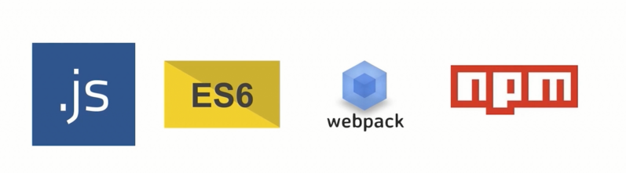

Vue2.5从零基础入门到实战项目开发去哪儿网App
# 第1章 课程介绍
	本章主要介绍课程的知识大纲，学习前提，讲授方式及预期收获。
## 1-1 课程简介

### 课程流程


### 知识点


### 课程安排


### 学习前提



### 讲授方式

1. 通俗易懂的案例讲解
2. 借助基础知识实现项目
3. 带着你编写每一行代码
4. 图文讲解复杂知识点

### 课程收获

1. 彻底入门Vue的使用
2. 理解整个Vue项目的开发流程
3. 移动端页面布局技巧
4. 上手中型Vue项目的开发
5. 规范的代码编写


# 第2章 Vue 起步
	本章将快速讲解部分 Vue 基础语法，通过 TodoList 功能的编写，
	在熟悉基础语法的基础上，扩展解析 MVVM 模式及前端组件化的概念及优势。
## 2-1 课程学习方法
> 官方文档:
>
> https://cn.vuejs.org/v2/guide/

- 基于官方文档
  - 视频学习后看官方文档

## 2-2 hello world

```html
<!DOCTYPE html>
<html lang="en">

<head>
  <meta charset="UTF-8">
  <meta name="viewport" content="width=device-width, initial-scale=1.0">
  <meta http-equiv="X-UA-Compatible" content="ie=edge">
  <title>Hello world</title>
  <script src="./vue.js"></script>
</head>

<body>
  <div id="app">{{content}}</div>
  <div>{{content}}</div>
  <script>
    // document.getElementById('app').innerHTML = 'Hello world'
    var app = new Vue({
      el: '#app',
      data: {
        content: 'Hello world'
      }
    })
    setTimeout(function () {
      app.$data.content = 'hi bye'
    }, 1000)
  </script>
</body>

</html>
```


## 2-3 开发TodoList（v-model、v-for、v-on）

```html
<!DOCTYPE html>
<html lang="en">

<head>
  <meta charset="UTF-8">
  <meta name="viewport" content="width=device-width, initial-scale=1.0">
  <meta http-equiv="X-UA-Compatible" content="ie=edge">
  <title>TodoList</title>
  <script src="./vue.js"></script>
</head>

<body>
  <div id="app">
    <input type="text" v-model="inputValue">
    <button v-on:click="handleBtnClick">提交</button>
    <ul>
      <li v-for="item in list">{{item}}</li>
    </ul>
  </div>
  <script>
    var app = new Vue({
      el: '#app',
      data: {
        list: ['第一课的内容', '第二课的内容'],
        inputValue: ''
      },
      methods: {
        handleBtnClick() {
          this.$data.list.unshift(this.inputValue)
          this.inputValue = ''
        }
      },
    })
  </script>
</body>

</html>
```


## 2-4 MVVM模式

**传统的 MVP 设计模式**

- Model : 数据层
- Presenter : 呈现层, 业务逻辑
- View : 视图层, DOM 展示


- 实例: 

  - 80% 代码在操作 DOM

  ```html
  <!DOCTYPE html>
  <html lang="en">
  
  <head>
    <meta charset="UTF-8">
    <meta name="viewport" content="width=device-width, initial-scale=1.0">
    <meta http-equiv="X-UA-Compatible" content="ie=edge">
    <title>TodoList JQuery</title>
    <script src="./jquery1.12.4.js"></script>
  </head>
  
  <body>
    <div id="app">
      <input type="text" id="input">
      <button id="btn">提交</button>
      <ul id="list"></ul>
    </div>
    <script>
      // M (模型层) V 视图 P(控制器)
      function Page() {
  
      }
      $.extend(Page.prototype, {
        init: function () {
          this.bindEvents()
        },
        bindEvents: function () {
          var btn = $('#btn')
          btn.on('click', $.proxy(this.handleBtnClick, this))
        },
        handleBtnClick: function () {
          var inputElm = $("#input")
          var inputValue = inputElm.val()
          var ulElem = $("#list")
          ulElem.append('<li>' + inputValue + '</li>')
          inputElm.val('')
        }
      })
  
      var page = new Page()
      page.init()
    </script>
  </body>
  
  </html>
  ```

  

**MVVM 设计模式**


- 只要操作 Model 层和 View 层
- Vue 自动帮我们操作 ViewModel 层
  - 通过 Object.defineProperties 和 虚拟 DOM 实现

## 2-5 前端组件化

- 每个组件就是页面的一个区域

## 2-6 使用组件改造TodoList

- 组件名驼峰`TodoItem`和标签名 `todo-item` 自动转换

```HTML
<!DOCTYPE html>
<html lang="en">

<head>
  <meta charset="UTF-8">
  <meta name="viewport" content="width=device-width, initial-scale=1.0">
  <meta http-equiv="X-UA-Compatible" content="ie=edge">
  <title>TodoList</title>
  <script src="./vue.js"></script>
</head>

<body>
  <div id="app">
    <input type="text" v-model="inputValue">
    <button v-on:click="handleBtnClick">提交</button>
    <ul>
      <!-- <li v-for="item in list">{{item}}</li> -->
      <todo-item v-bind:content="item" v-for="item in list">
      </todo-item>
    </ul>
  </div>
  <script>
    // // 全局组件
    // Vue.component("TodoItem", {
    //   props: ['content'], // 接收 v-bind:content 传递的值
    //   template: "<li>{{content}}</li>" // 模板内使用字符串
    // })

    var TodoItem = {
      props: ['content'],
      template: "<li>{{content}}</li>"
    }

    var app = new Vue({
      el: '#app',
      components: {
        TodoItem: TodoItem // 注册局部组件
      },
      data: {
        list: ['第一课的内容', '第二课的内容'],
        inputValue: ''
      },
      methods: {
        handleBtnClick() {
          this.$data.list.unshift(this.inputValue)
          this.inputValue = ''
        }
      },
    })
  </script>

</body>

</html>
```


## 2-7 简单的组件间传值

```HTMl
<!DOCTYPE html>
<html lang="en">

<head>
  <meta charset="UTF-8">
  <meta name="viewport" content="width=device-width, initial-scale=1.0">
  <meta http-equiv="X-UA-Compatible" content="ie=edge">
  <title>TodoList</title>
  <script src="./vue.js"></script>
</head>

<body>
  <div id="app">
    <input type="text" v-model="inputValue">
    <button v-on:click="handleBtnClick">提交</button>
    <ul>
      <!-- <li v-for="item in list">{{item}}</li> -->

      <!-- v-bind: 可以简写为: -->
      <!-- v-on: 可以简写为@ -->
      <!-- @delete="handleItemDelete" 监听 $emit 传递的 delete 事件 -->
      <todo-item :content="item" :index="index" v-for="(item,index) in list" @delete="handleItemDelete">
      </todo-item>
    </ul>
  </div>
  <script>
    // // 全局组件
    // Vue.component("TodoItem", {
    //   props: ['content'], // 接收 v-bind:content 传递的值
    //   template: "<li>{{content}}</li>" // 模板内使用字符串
    // })

    var TodoItem = {
      // 父组件向子组件传值, v-bind: 发送和 props 接收
      props: ['content', 'index'],
      template: "<li @click='handleItemClick'>{{content}}</li>",
      methods: {
        handleItemClick: function () {
          // $emit 向外触发事件; 父组件监听此事件传值
          this.$emit("delete", this.index);
        }
      }
    }

    var app = new Vue({
      el: '#app',
      components: {
        TodoItem: TodoItem // 注册局部组件
      },
      data: {
        list: ['第一课的内容', '第二课的内容'],
        inputValue: ''
      },
      methods: {
        handleBtnClick: function () {
          this.$data.list.unshift(this.inputValue)
          this.inputValue = ''
        },
        handleItemDelete: function (index) {
          this.list.splice(index, 1)
        }
      },
    })
  </script>

</body>

</html>
```


## 2-8 章节小结

作业: 仔细阅读Vue介绍部分文档, 查漏补缺

1. `v-bind` attribute 被称为**指令**

2. `app3.seen = false` : 显示或隐藏元素

3.  `v-for` 指令可以绑定数组的数据来渲染一个项目列表

   - `v-for="todo in todos"`

4.  `v-on` 指令添加一个事件监听器，通过它调用在 Vue 实例中定义的方法

   - `v-on:click="reverseMessage"`

5. `v-model` 指令，它能轻松实现表单输入和应用状态之间的双向绑定

   - ```html
     <div id="app-6">
       <p>{{ message }}</p>
       <input v-model="message">
     </div>
     <script>
     var app6 = new Vue({
       el: '#app-6',
       data: {
         message: 'Hello Vue!'
       }
     })
     </script>
     ```

6. 组件系统允许我们使用小型、独立和通常可复用的组件构建大型应用。几乎任意类型的应用界面都可以抽象为一个组件树：

   - 一个组件本质上是一个拥有预定义选项的一个 Vue 实例。

   - ```js
     // 定义名为 todo-item 的新组件
     Vue.component('todo-item', {
       template: '<li>这是个待办项</li>'
     })
     ```

     

   

7. 子单元通过 prop 接口与父单元进行了良好的解耦。


# 第3章 Vue 基础精讲
	本章通过精挑细选的案例，精讲 Vue 中的基础知识，
	包括实例、生命周期、指令、计算属性、方法、侦听器，表单等部分内容。
## 3-1 Vue实例

```html
<!DOCTYPE html>
<html lang="en">

<head>
  <meta charset="UTF-8">
  <meta name="viewport" content="width=device-width, initial-scale=1.0">
  <meta http-equiv="X-UA-Compatible" content="ie=edge">
  <title>Vue实例</title>
  <script src="./vue.js"></script>
</head>

<body>
  <div id="root">
    <!-- v-bind: 可以简写为: -->
    <!-- v-on: 可以简写为@ -->
    <!-- 插值表达式 -->
    <div @click="handleClick">{{message}}</div>
    <!-- 子组件 -->
    <item></item>
  </div>

  <script>
    // Vue 组件, 底层会转换为 Vue 实例
    Vue.component('item', {
      template: '<div>hello item</div>'
    })


    // 根实例, 入口
    var vm = new Vue({
      // el 指Vue接管的元素element
      el: '#root',
      // data 指元素所需的数据
      data: {
        message: 'hello world'
      },
      // methods 指元素所需的方法
      methods: {
        handleClick() {
          alert('hello')
        }
      }
    })
  </script>
</body>

</html>
```


## 3-2 Vue实例生命周期

1. 当这些数据改变时，视图会进行重渲染。值得注意的是只有当实例被创建时就已经存在于 `data` 中的属性才是**响应式**的

2. 使用 `Object.freeze()`，这会阻止修改现有的属性，也意味着响应系统无法再*追踪*变化。

3. Vue 实例还暴露了一些有用的实例属性与方法。它们都有前缀 `$`，以便与用户定义的属性区分开来。

4. 每个 Vue 实例在被创建时都要经过一系列的初始化过程——例如，需要设置数据监听、编译模板、将实例挂载到 DOM 并在数据变化时更新 DOM 等。同时在这个过程中也会运行一些叫做**生命周期钩子**的函数，这给了用户在不同阶段添加自己的代码的机会。

   > 不要在选项属性或回调上使用[箭头函数](https://developer.mozilla.org/zh-CN/docs/Web/JavaScript/Reference/Functions/Arrow_functions)，比如 `created: () => console.log(this.a)` 或 `vm.$watch('a', newValue => this.myMethod())`。因为箭头函数并没有 `this`，`this` 会作为变量一直向上级词法作用域查找，直至找到为止，经常导致 `Uncaught TypeError: Cannot read property of undefined` 或 `Uncaught TypeError: this.myMethod is not a function` 之类的错误。

5. `template` : 没有指定 `template` 时, 将 `el` 外部 `HTML` 作为 `template` 编译


```html
<!DOCTYPE html>
<html lang="en">

<head>
  <meta charset="UTF-8">
  <meta name="viewport" content="width=device-width, initial-scale=1.0">
  <meta http-equiv="X-UA-Compatible" content="ie=edge">
  <title>Vue生命周期钩子</title>
  <script src="./vue.js"></script>
</head>

<body>
  <div id="root">{{content}}</div>

  <script>
    var vm = new Vue({
      el: '#root',
      beforeCreate: function () {
        console.log('beforeCreate');
      },
      created: function () {
        console.log('created');
      },
      beforeMount: function () {
        console.log('beforeMount', this.$el);
      },
      mounted: function () {
        console.log('mounted', this.$el);
      },
      beforeDestroy: function () {
        console.log('beforeDestroy');
      },
      destroyed: function () {
        console.log('destroyed');
      },
      beforeUpdate: function () {
        console.log('beforeUpdate');
      },
      updated: function () {
        console.log('updated');
      },
      data: {
        content: 'hello'
      },
      template: '<div>world</div>'
    })
  </script>
</body>

</html>
```


## 3-3 Vue的模版语法

1. 插值表达式 : `{{content}}`
2. `v-text="content"` : 等同于插值表达式, 等号后面是 JS表达式
   - 有个限制就是，每个绑定都只能包含**单个表达式**
   - 模板表达式都被放在沙盒中，只能访问[全局变量的一个白名单](https://github.com/vuejs/vue/blob/v2.6.10/src/core/instance/proxy.js#L9)，如 `Math` 和 `Date` 。你不应该在模板表达式中试图访问用户定义的全局变量。
3. `v-html="content"` : 不转义，会渲染 html 标签
4. “Mustache”语法 (双大括号) 语法不能作用在 HTML attribute 上，遇到这种情况应该使用 [`v-bind` 指令](https://cn.vuejs.org/v2/api/#v-bind)：

```html
<!DOCTYPE html>
<html lang="en">

<head>
  <meta charset="UTF-8">
  <meta name="viewport" content="width=device-width, initial-scale=1.0">
  <meta http-equiv="X-UA-Compatible" content="ie=edge">
  <title>Vue模板语法</title>
  <script src="./vue.js"></script>
</head>

<body>
  <div id="app">
    <div>{{content}}</div>
    <div v-text="content + 'Lee'"></div>
    <div v-html="content.split('l')[0]"></div>
  </div>

  <script>
    var vm = new Vue({
      el: '#app',
      data: {
        content: '<h1>hello</h1>'
      }
    })
  </script>
</body>

</html>
```

### [参数和动态参数](https://cn.vuejs.org/v2/guide/syntax.html#参数)

一些指令能够接收一个“参数”，在指令名称之后以冒号表示。例如，`v-bind` 指令可以用于响应式地更新 HTML attribute：

```html
<a v-bind:href="url">...</a>
```

在这里 `href` 是参数，告知 `v-bind` 指令将该元素的 `href` attribute 与表达式 `url` 的值绑定。

另一个例子是 `v-on` 指令，它用于监听 DOM 事件：

```html
<a v-on:click="doSomething">...</a>
```

在这里参数是监听的事件名。我们也会更详细地讨论事件处理。

**动态参数**

从 2.6.0 开始，可以用方括号括起来的 JavaScript 表达式作为一个指令的参数：

```html
<!--
注意，参数表达式的写法存在一些约束，如之后的“对动态参数表达式的约束”章节所述。
-->
<a v-bind:[attributeName]="url"> ... </a>

<!-- eventName 变量 -->
<a v-on:[eventName]="doSomething"> ... </a>

<!-- 这会触发一个编译警告：引号、空格 -->
<a v-bind:['foo' + bar]="value"> ... </a>
```

**对动态参数的值的约束**

动态参数预期会求出一个字符串，异常情况下值为 `null`。这个特殊的 `null` 值可以被显性地用于移除绑定。任何其它非字符串类型的值都将会触发一个警告。

**对动态参数表达式的约束**

动态参数表达式有一些语法约束，因为某些字符，如空格和引号，放在 HTML attribute 名里是无效的。

变通的办法是使用没有空格或引号的表达式，或用计算属性替代这种复杂表达式。

在 DOM 中使用模板时 (直接在一个 HTML 文件里撰写模板)，还需要避免使用大写字符来命名键名，浏览器会把 attribute 名全部强制转为小写。

### [缩写](https://cn.vuejs.org/v2/guide/syntax.html#缩写)

[`v-bind` 缩写](https://cn.vuejs.org/v2/guide/syntax.html#v-bind-缩写)

```html
<!-- 完整语法 -->
<a v-bind:href="url">...</a>

<!-- 缩写 -->
<a :href="url">...</a>

<!-- 动态参数的缩写 (2.6.0+) -->
<a :[key]="url"> ... </a>
```

[`v-on` 缩写](https://cn.vuejs.org/v2/guide/syntax.html#v-on-缩写)

```html
<!-- 完整语法 -->
<a v-on:click="doSomething">...</a>

<!-- 缩写 -->
<a @click="doSomething">...</a>

<!-- 动态参数的缩写 (2.6.0+) -->
<a @[event]="doSomething"> ... </a>
```


## 3-4 计算属性,方法与侦听器

```html
<!DOCTYPE html>
<html lang="en">

<head>
  <meta charset="UTF-8">
  <meta name="viewport" content="width=device-width, initial-scale=1.0">
  <meta http-equiv="X-UA-Compatible" content="ie=edge">
  <title>3.4.计算属性方法侦听器</title>
  <script src="./vue.js"></script>
</head>

<body>
  <div id="app">
    <div>{{fullName}}</div>
  </div>

  <script>
    var vm = new Vue({
      el: '#app',
      data: {
        firstName: "Dell",
        lastName: "Lee",
        fullName: "Dell Lee",
        age: 28
      },
      // 侦听器 内置缓存,类似于 computed ,它不依赖的值发生改变不会重新计算,但语法复杂,推荐使用 computed
      watch: {
        firstName: function () {
          console.log("firstName计算了一次");
          this.fullName = this.firstName + " " + this.lastName
        },
        lastName: function () {
          console.log("lastName计算了一次");
          this.fullName = this.firstName + " " + this.lastName
        }
      }
      // 计算属性  它内置缓存,它不依赖的值发生改变不会重新计算
      // computed: {
      //   fullName: function () {
      //     console.log("计算了一次");
      //     return this.firstName + " " + this.lastName
      //   }
      // }
      // 无缓存,效率低于computed 和 watch
      // methods: {
      //   fullName() {
      //     console.log("计算了一次");
      //     return this.firstName + " " + this.lastName
      //   }
      // }
    })
  </script>
</body>

</html>
```

- 我们可以将同一函数定义为一个方法而不是一个计算属性。两种方式的最终结果确实是完全相同的。然而，不同的是**计算属性是基于它们的响应式依赖进行缓存的**。只在相关响应式依赖发生改变时它们才会重新求值。这就意味着只要 `message` 还没有发生改变，多次访问 `reversedMessage` 计算属性会立即返回之前的计算结果，而不必再次执行函数。
- 相比之下，每当触发重新渲染时，调用方法将**总会**再次执行函数。

### [侦听器](https://cn.vuejs.org/v2/guide/computed.html#侦听器)

虽然计算属性在大多数情况下更合适，但有时也需要一个自定义的侦听器。这就是为什么 Vue 通过 `watch` 选项提供了一个更通用的方法，来响应数据的变化。当需要在数据变化时执行异步或开销较大的操作时，这个方式是最有用的。


## 3-5 计算属性的 getter 和 setter

```html
<!DOCTYPE html>
<html lang="en">

<head>
  <meta charset="UTF-8">
  <meta name="viewport" content="width=device-width, initial-scale=1.0">
  <meta http-equiv="X-UA-Compatible" content="ie=edge">
  <title>3.5.getter和setter</title>
  <script src="./vue.js"></script>
</head>

<body>
  <div id="app">
    <div>{{fullName}}</div>
  </div>

  <script>
    var vm = new Vue({
      el: '#app',
      data: {
        firstName: "Dell",
        lastName: "Lee"
      },
      computed: {
        fullName: {
          get: function () {
            return this.firstName + " " + this.lastName
          },
          set: function (value) {
            var arr = value.split(" ");
            this.firstName = arr[0]
            this.lastName = arr[1]
          }
        }
      }
    })
  </script>
</body>

</html>
```


## 3-6 Vue中的样式绑定 style

```html
<!DOCTYPE html>
<html lang="en">

<head>
  <meta charset="UTF-8">
  <meta name="viewport" content="width=device-width, initial-scale=1.0">
  <meta http-equiv="X-UA-Compatible" content="ie=edge">
  <title>3.5.getter和setter</title>
  <script src="./vue.js"></script>
  <style>
    .activated {
      color: red;
    }
  </style>
</head>

<body>
  <div id="app">
    <!-- class 的对象绑定 -->
    <div @click="handleDivClick" :class="{activated: isActivated}">Hello World</div>

    <!-- class 显示数组内变量的值,可以动态添加类 -->
    <div @click="handleDivClick" :class="[activated, one]">Hello World</div>

    <!-- style 方式改变样式 -->
    <div :style="styleObj" @click="handleDivClick">Hello World</div>

    <!-- style 样式由数组里的对象决定,可以添加多个对象 -->
    <div :style="[styleObj,{fontSize:'20px'}]" @click="handleDivClick">Hello World</div>
  </div>

  <script>
    var vm = new Vue({
      el: '#app',
      data: {
        isActivated: false,
        activated: "",
        one: "ac-one",
        styleObj: {
          color: ""
        }
      },
      methods: {
        handleDivClick: function () {
          // 1
          this.isActivated = !this.isActivated
          // 2
          if (this.activated === "") {
            this.activated = "activated"
          } else {
            this.activated = ""
          }
          // 3
          if (this.styleObj.color === "") {
            this.styleObj.color = "red"
          } else {
            this.styleObj.color = ""
          }
        }
      }
    })
  </script>
</body>

</html>
```

### [对象语法](https://cn.vuejs.org/v2/guide/class-and-style.html#对象语法)

我们可以传给 `v-bind:class` 一个对象，以动态地切换 class：

```html
<div v-bind:class="{ active: isActive }"></div>
```

上面的语法表示 `active` 这个 class 存在与否将取决于数据 property `isActive` 的 [truthiness](https://developer.mozilla.org/zh-CN/docs/Glossary/Truthy)。

你可以在对象中传入更多字段来动态切换多个 class。此外，`v-bind:class` 指令也可以与普通的 class attribute 共存。当有如下模板：

```html
<div
  class="static"
  v-bind:class="{ active: isActive, 'text-danger': hasError }"
></div>
```

绑定的数据对象不必内联定义在模板里：

```html
<div v-bind:class="classObject"></div>
data: {
  classObject: {
    active: true,
    'text-danger': false
  }
}
```

渲染的结果和上面一样。我们也可以在这里绑定一个返回对象的[计算属性](https://cn.vuejs.org/v2/guide/computed.html)。这是一个常用且强大的模式：

```html
<div v-bind:class="classObject"></div>
data: {
  isActive: true,
  error: null
},
computed: {
  classObject: function () {
    return {
      active: this.isActive && !this.error,
      'text-danger': this.error && this.error.type === 'fatal'
    }
  }
}
```

### [数组语法](https://cn.vuejs.org/v2/guide/class-and-style.html#数组语法)

我们可以把一个数组传给 `v-bind:class`，以应用一个 class 列表：

```html
<div v-bind:class="[activeClass, errorClass]"></div>
data: {
  activeClass: 'active',
  errorClass: 'text-danger'
}
```

如果你也想根据条件切换列表中的 class，可以用三元表达式：

```html
<div v-bind:class="[isActive ? activeClass : '', errorClass]"></div>
```

这样写将始终添加 `errorClass`，但是只有在 `isActive` 是 truthy[[1\]](https://cn.vuejs.org/v2/guide/class-and-style.html#footnote-1) 时才添加 `activeClass`。

不过，当有多个条件 class 时这样写有些繁琐。所以在数组语法中也可以使用对象语法：

```html
<div v-bind:class="[{ active: isActive }, errorClass]"></div>
```


## 3-7 Vue中的条件渲染

- 添加 `key` 属性, 防止标签内容复用

```html
<!DOCTYPE html>
<html lang="en">

<head>
  <meta charset="UTF-8">
  <meta name="viewport" content="width=device-width, initial-scale=1.0">
  <meta http-equiv="X-UA-Compatible" content="ie=edge">
  <title>3.5.getter和setter</title>
  <script src="./vue.js"></script>
  <style>
    .activated {
      color: red;
    }
  </style>
</head>

<body>
  <div id="app">
    <!-- v-if 判断是否渲染 -->
    <div v-if="show ==='false'">This is false</div>
    <div v-else-if="show==='true'">This is true</div>
    <!-- v-if v-else v-else-if 必须紧贴在一起使用 -->
    <div v-else>Bye</div>
    <!-- v-show 渲染后设置样式,性能较高 -->
    <div v-show="show">{{message + 'v-show'}}</div>

    <!-- key 值指唯一的元素,渲染时就不会复用input输入的内容 -->
    <div v-if="show ==='false'">
      用户名: <input type="text" key="username">
    </div>
    <div v-if="show==='true'">
      邮箱: <input type="text" key="mail">
    </div>
  </div>

  <script>
    var vm = new Vue({
      el: '#app',
      data: {
        show: 'false',
        message: "Hello World"
      }
    })
  </script>
</body>

</html>
```


## 3-8 Vue中的列表渲染

- 建议尽可能在使用 `v-for` 时提供 `key` attribute , 请用字符串或数值类型的值。
- 变异方法
  - `push()`
  - `pop()`
  - `shift()`
  - `unshift()`
  - `splice()`
  - `sort()`
  - `reverse()`
- 也有非变异 (non-mutating method) 方法，
  - 例如 `filter()`、`concat()` 和 `slice()`

```html
<!DOCTYPE html>
<html lang="en">

<head>
  <meta charset="UTF-8">
  <meta name="viewport" content="width=device-width, initial-scale=1.0">
  <meta http-equiv="X-UA-Compatible" content="ie=edge">
  <title>3.5.getter和setter</title>
  <script src="./vue.js"></script>
  <style>
    .activated {
      color: red;
    }
  </style>
</head>

<body>
  <div id="app">
    <!-- template 占位符,相当于div 但不会出现在dom元素中 -->
    <template v-for="(item,index) of list" :key="item.id">
      <li>{{item.text+":"+item.id}}</li>
      <em>{{item.text}}</em>
    </template>
    <div v-for="(item,key,index) of userInfo">{{index}}--{{key}}--{{item}}</div>
  </div>

  <script>
    var vm = new Vue({
      el: '#app',
      data: {
        // 只能使用 vue提供的数组函数才能监听变化
        // push pop shift unshift splice sort reverse
        // 直接通过下标更改数组页面不会响应
        // 改变list 数组的引用也可以
        list: [{
          id: "12",
          text: "hello "
        }, {
          id: "13",
          text: "hello2 "
        }, {
          id: "14",
          text: "hello3 "
        }],
        // 对象的循环
        // 改变userInfo 对象的引用也可以
        userInfo: {
          name: "Dell",
          age: 28,
          gender: "male",
          salary: "secret"
        }
      }
    })
  </script>
</body>

</html>
```


## 3-9 Vue中的set方法

- `Vue.set(array,index,value)` 或 `$set(array,index,value)` 方法直接动态改变数组的每一项
-  `set(obj,key,value)` 或 `$set(obj,key,value)` 方法可以直接动态改变对象数据
- **Vue 不能检测对象属性的添加或删除**：

```js
var vm = new Vue({
      el: '#app',
      data: {
        // 只能使用 vue提供的数组函数才能监听变化
        // push pop shift unshift splice sort reverse
        // 直接通过下标更改数组页面不会响应
        // 改变list 数组的引用也可以
        // Vue.set(array,index,value) 或 $set(array,index,value) 方法改变数组的每一项
        list: [{
          id: "12",
          text: "hello "
        }, {
          id: "13",
          text: "hello2 "
        }, {
          id: "14",
          text: "hello3 "
        }],
        // 对象的循环
        // 改变userInfo 对象的引用也可以
        // 通过Vue 支持的 set(obj,key,value) 方法可以动态改变数据
        // 通过Vue 自带的 $set 实现同样的效果
        userInfo: {
          name: "Dell",
          age: 28,
          gender: "male",
          salary: "secret"
        }
      }
    })
```


# 第4章 深入理解 Vue 组件
	本章将深入讲解 Vue 组件使用的细节点，从父子组件的参数传递及校验入手，
	逐步深入到非父子组件间传值、插槽、作用域插槽、动态组件等内容的讲解。
## 4-1 使用组件的细节点

1. 模板标签 BUG 问题: 与 HTML5 标准冲突

   - 使用 `<tr is="模板标签"></tr>` 来引入模板标签
   - 在 `table ul ol select` 固定搭配的标签下建议使用这种方式

2. 在子组件中, `data` 必须是个函数, 避免重复调用时, 对象重复引用相互影响

   ```js
   Vue.component('row',{
   	data: function(){
   		return {
   			content: 'this is row'
   		}
   	},
   	template: '<tr><td>{{content}}</td></tr>'
   })
   ```

3. 通过 `$refs` 和 `ref` 获取元素节点

   ```html
   <body>
     <div id="root">
       <div ref="hello" @click="handleClick">Hello World</div>
     </div>
   
     <script>
       var vm = new Vue({
         el: '#root',
         methods: {
           handleClick: function () {
             console.log(this.$refs.hello.innerHTML);
   
           }
         }
       })
     </script>
   </body>
   ```

4. 使用 ref 两个组件之间求和实例 :

   - 如果 ref 写在组件上, 则获取到的是组件的引用

   ```html
   <body>
     <div id="root">
       <counter ref="one" @change="handleChange"></counter>
       <counter ref="two" @change="handleChange"></counter>
       <div>{{total}} </div>
     </div>
   
     <script>
       Vue.component('counter', {
         template: '<div @click="handleClick">{{number}}</div>',
         data: function () {
           return {
             number: 0
           }
         },
         methods: {
           handleClick: function () {
             this.number++
             this.$emit('change')
           }
         }
       })
   
       var vm = new Vue({
         el: '#root',
         data: {
           total: 0
         },
         methods: {
           handleChange: function () {
             this.total = this.$refs.one.number + this.$refs.two.number
           }
         }
       })
     </script>
   </body>
   ```

   

## 4-2 父子组件间的数据传递

1. 父组件通过属性( `content="字符串"` / `:content="变量"` ) 向子组件传值, 子组件使用 `props` 接收
2. 子组件通过事件触发( $emit )向父组件传值, 父组件监听事件并使用函数接收
3. 子组件只能修改自己拥有的数据,不能修改父组件传递的值
4. 子组件使用父组件传递的值时,先复制到自己的对象中再修改使用

```html
<body>
  <div id="root">
    <counter :count="0" @change="handleIncrease"></counter>
    <counter :count="0" @change="handleIncrease"></counter>
    <div>{{total}}</div>
  </div>

  <script>
    // 父组件通过属性向子组件传值,子组件通过事件触发向父组件传值
    Vue.component('counter', {
      // 子组件只能修改自己拥有的数据,不能修改父组件传递的值
      // 子组件使用父组件传递的值时,先复制到自己的对象中再修改使用
      template: '<div @click="handleClick">{{number}}</div>',
      props: ['count'],
      methods: {
        handleClick: function () {
          this.number += 2
          this.$emit('change', 2)
        }
      },
      data: function () {
        return {
          number: this.count
        }
      }
    })

    var vm = new Vue({
      el: '#root',
      data: {
        total: 0
      },
      methods: {
        handleIncrease: function (step) {
          this.total += step
        }
      }
    })
  </script>
</body>
```


## 4-3 组件参数校验与非 props 特性

- 参数校验

  ```html
  <body>
    <div id="root">
      <child content="hello"></child>
    </div>
  
    <script>
      Vue.component('child', {
        // props: ['content'], // 使用对象约束参数
        props: {
          // content: [Number, String]
          content: {
            type: String,
            required: false, // 是否必须
            default: 'default', // 默认值
            validator: function (value) {
              // 校验器,不符合则返回警告
              return (value.length > 6)
            }
          }
        },
        template: '<div>{{content}}</div>'
      })
  
      var vm = new Vue({
        el: '#root'
  
      })
    </script>
  </body>
  ```

- props 特性

  - 父子组件传递的属性一一对应

- 非 props 特性

  - 父组件传递属性,子组件未声明,子组件无法使用
  - 属性会显示在子组件最外层的HTML标签中


## 4-4 给组件绑定原生事件

- 在HTML元素标签中, `@click=""` 绑定原生事件
- 在子组件中, `@click=""` 绑定自定义事件
  - 使用 `$emit('click')` 触发自定义事件
- 在子组件中, `@click.native=""` 绑定原生事件, 使用修饰符

## 4-5 非父子组件间的传值

1. Vuex

2. 总线机制/Bus/发布订阅模式/观察者模式

   1. `Vue.prototype.bus = new Vue()` : 创建 bus 总线
   2. ` this.bus.$emit('change', this.selfContent)` : 触发事件到 bus 总线
   3. `this.bus.$on('change', function (msg){}` : 监听 bus 总线的事件

3. #### `.sync` 修饰符

   > 2.3.0+ 新增

   在有些情况下，我们可能需要对一个 prop 进行“双向绑定”。不幸的是，真正的双向绑定会带来维护上的问题，因为子组件可以修改父组件，且在父组件和子组件都没有明显的改动来源。

   这也是为什么我们推荐以 `update:myPropName` 的模式触发事件取而代之。举个例子，在一个包含 `title` prop 的假设的组件中，我们可以用以下方法表达对其赋新值的意图：

   ```js
   this.$emit('update:title', newTitle)
   ```

   然后父组件可以监听那个事件并根据需要更新一个本地的数据属性。例如：

   ```html
   <text-document
     v-bind:title="doc.title"
     v-on:update:title="doc.title = $event"
   ></text-document>
   ```

   为了方便起见，我们为这种模式提供一个缩写，即 `.sync` 修饰符：

   ```html
   <text-document v-bind:title.sync="doc.title"></text-document>
   ```

   > 注意带有 `.sync` 修饰符的 `v-bind` **不能**和表达式一起使用 (例如 `v-bind:title.sync=”doc.title + ‘!’”` 是无效的)。取而代之的是，你只能提供你想要绑定的属性名，类似 `v-model`。

   当我们用一个对象同时设置多个 prop 的时候，也可以将这个 `.sync` 修饰符和 `v-bind` 配合使用：

   ```html
   <text-document v-bind.sync="doc"></text-document>
   ```

   这样会把 `doc` 对象中的每一个属性 (如 `title`) 都作为一个独立的 prop 传进去，然后各自添加用于更新的 `v-on` 监听器。

   > 将 `v-bind.sync` 用在一个字面量的对象上，例如 `v-bind.sync=”{ title: doc.title }”`，是无法正常工作的，因为在解析一个像这样的复杂表达式的时候，有很多边缘情况需要考虑。

```html
<body>
  <div id="root">
    <child content="hello"></child>
    <child content="world"></child>
  </div>

  <script>
    Vue.prototype.bus = new Vue()

    Vue.component('child', {
      props: {
        content: String
      },
      data: function () {
        return {
          selfContent: this.content
        }
      },
      methods: {
        handleClick: function () {
          this.bus.$emit('change', this.selfContent)
        }
      },
      template: '<div @click="handleClick">{{selfContent}}</div>',
      mounted: function () {
        var _this = this
        this.bus.$on('change', function (msg) {
          _this.selfContent = msg
        })
      }
    })

    var vm = new Vue({
      el: '#root'
    })
  </script>
</body>
```


## 4-6 在Vue中使用插槽

- 对于这样的情况，`<slot>` 元素有一个特殊的 attribute：`name`。这个 attribute 可以用来定义额外的插槽：

- 一个不带 `name` 的 `<slot>` 出口会带有隐含的名字“default”。

- 在向具名插槽提供内容的时候，我们可以在一个 `<template>` 元素上使用 `v-slot` 指令，并以 `v-slot` 的参数的形式提供其名称：

- 注意 **`v-slot` 只能添加在 **`<template>` **上** (只有[一种例外情况](https://cn.vuejs.org/v2/guide/components-slots.html#独占默认插槽的缩写语法))，这一点和已经废弃的 [`slot` attribute](https://cn.vuejs.org/v2/guide/components-slots.html#废弃了的语法)不同。

  > `v-slot` 指令自 Vue 2.6.0 起被引入，提供更好的支持 `slot` 和 `slot-scope` attribute 的 API 替代方案。`v-slot` 完整的由来参见这份 [RFC](https://github.com/vuejs/rfcs/blob/master/active-rfcs/0001-new-slot-syntax.md)。在接下来所有的 2.x 版本中 `slot` 和 `slot-scope` attribute 仍会被支持，但已经被官方废弃且不会出现在 Vue 3 中。

- `<slot> 默认内容</slot>` : 插槽
  - 父组件往子组件添加内容, 使用插槽标签使用添加的内容
  - 可以设置默认值, 父组件未添加内容时显示
- `<slot name="header"></slot>` : 具名插槽

```html
<body>
  <div id="root">
    <child>
      <!-- 旧语法 -->
      <!-- <div class="header" slot="header">header</div>
      <div class="header" slot="footer">footer</div> -->

      <!-- template v-slot 具名插槽,新语法 -->
      <template v-slot:header>
        <div>这是头部</div>
      </template>
      <template v-slot:footer>
        <div>这是底部</div>
      </template>
    </child>
    <!-- 后备内容 -->
    <submit-button>
      Save
    </submit-button>
  </div>

  <script>
    Vue.component('child', {
      // 自 2.6.0 起有所更新。已废弃的使用 slot attribute 的语法
      template: `<div>
        <slot name="header">9999</slot>
        <div>content</div>
        <slot name="footer"></slot>
        </div>
        `
    })
    // Vue 官方示例: 后备内容
    Vue.component('submit-button', {
      template: `
        <button type="submit">
          <slot>Submit</slot>
        </button>
        `
    })

    var vm = new Vue({
      el: '#root'
    })
  </script>
</body>
```


## 4-7 作用域插槽

- ~~必须使用 `template` 标签包裹, `slot-scope="props"` 指定存储数据的变量, `:item=item` 要传递的数据~~


- 独占默认插槽的缩写语法

  - 绑定在 `<slot>` 元素上的 attribute 被称为**插槽 prop**。现在在父级作用域中，我们可以使用带值的 `v-slot` 来定义我们提供的插槽 prop 的名字：

    ```html
    <current-user>
      <template v-slot:default="slotProps">
        {{ slotProps.user.firstName }}
      </template>
    </current-user>
    ```

    这种写法还可以更简单。就像假定未指明的内容对应默认插槽一样，不带参数的 `v-slot` 被假定对应默认插槽：

    ```html
    <current-user v-slot="slotProps">
      {{ slotProps.user.firstName }}
    </current-user>
    ```

    

  - 注意默认插槽的缩写语法**不能**和具名插槽混用，因为它会导致作用域不明确：

    ```html
    <!-- 无效，会导致警告 -->
    <current-user v-slot="slotProps">
      {{ slotProps.user.firstName }}
      <template v-slot:other="otherSlotProps">
        slotProps is NOT available here
      </template>
    </current-user>
    ```

  - 只要出现多个插槽，请始终为*所有的*插槽使用完整的基于 `<template>` 的语法：

    ```html
    <current-user>
      <template v-slot:default="slotProps">
        {{ slotProps.user.firstName }}
      </template>
    
      <template v-slot:other="otherSlotProps">
        ...
      </template>
    </current-user>
    ```

- 解构插槽 Prop

  - `v-slot` 的值实际上可以是任何能够作为函数定义中的参数的 JavaScript 表达式。所以在支持的环境下 ([单文件组件](https://cn.vuejs.org/v2/guide/single-file-components.html)或[现代浏览器](https://developer.mozilla.org/zh-CN/docs/Web/JavaScript/Reference/Operators/Destructuring_assignment#浏览器兼容))，你也可以使用 [ES2015 解构](https://developer.mozilla.org/zh-CN/docs/Web/JavaScript/Reference/Operators/Destructuring_assignment#解构对象)来传入具体的插槽 prop，如下：

    ```html
    <current-user v-slot="{ user }">
      {{ user.firstName }}
    </current-user>
    ```

  - 这样可以使模板更简洁，尤其是在该插槽提供了多个 prop 的时候。它同样开启了 prop 重命名等其它可能，例如将 `user` 重命名为 `person`：

    ```html
    <current-user v-slot="{ user: person }">
      {{ person.firstName }}
    </current-user>
    ```

    你甚至可以定义后备内容，用于插槽 prop 是 undefined 的情形：

    ```html
    <current-user v-slot="{ user = { firstName: 'Guest' } }">
      {{ user.firstName }}
    </current-user>
    ```

- ### 动态插槽名

  > 2.6.0 新增

  [动态指令参数](https://cn.vuejs.org/v2/guide/syntax.html#动态参数)也可以用在 `v-slot` 上，来定义动态的插槽名：

  ```html
  <base-layout>
    <template v-slot:[dynamicSlotName]>
      ...
    </template>
  </base-layout>
  ```

- ### 具名插槽的缩写

  > 2.6.0 新增

  跟 `v-on` 和 `v-bind` 一样，`v-slot` 也有缩写，即把参数之前的所有内容 (`v-slot:`) 替换为字符 `#`。例如 `v-slot:header` 可以被重写为 `#header`：

  ```html
  <base-layout>
    <template #header>
      <h1>Here might be a page title</h1>
    </template>
  
    <p>A paragraph for the main content.</p>
    <p>And another one.</p>
  
    <template #footer>
      <p>Here's some contact info</p>
    </template>
  </base-layout>
  ```

  然而，和其它指令一样，该缩写只在其有参数的时候才可用。这意味着以下语法是无效的：

  ```html
  <!-- 这样会触发一个警告 -->
  <current-user #="{ user }">
    {{ user.firstName }}
  </current-user>
  ```

  如果你希望使用缩写的话，你必须始终以明确插槽名取而代之：

  ```html
  <current-user #default="{ user }">
    {{ user.firstName }}
  </current-user>
  ```

- 代码

```html
<!DOCTYPE html>
<html lang="en">

<head>
  <meta charset="UTF-8">
  <meta name="viewport" content="width=device-width, initial-scale=1.0">
  <meta http-equiv="X-UA-Compatible" content="ie=edge">
  <title>作用域插槽.html</title>
  <script src="./vue.js"></script>
</head>

<body>
  <div id="root">
    <!-- 旧语法 -->
    <child>
      <template slot-scope="props">
        <h1>{{props.item}}</h1>
      </template>
    </child>
    <!-- 官方示例 -->
    <!-- 绑定在 <slot> 元素上的 attribute 被称为插槽 prop。
      现在在父级作用域中，我们可以使用带值的 v-slot 来定义
      我们提供的插槽 prop 的名字： -->
    <current-user>
      <template #default="{user, person = { lastName:'Guest'}}">
        {{ user.lastName }}-{{person.lastName}}
      </template>
      <!-- template 的作用域插槽名要与 slot 的 name 一致 -->
      <template #other="{user, person = { lastName:'Guest'}}">
        {{ user.lastName }}-{{person.lastName}}
      </template>
    </current-user>
  </div>

  <script>
    // 旧语法
    Vue.component('child', {
      data: function () {
        return {
          list: [1, 2, 3, 4, 5]
        }
      },
      template: `<div>
          <slot v-for="item of list" :item="item">{{item}}</slot>
        </div>
        `
    })

    // 官方示例
    // 为了让 user 在父级的插槽内容中可用，
    // 我们可以将 user 作为 <slot> 元素的一个 attribute 绑定上去：
    Vue.component('current-user', {
      data: function () {
        return {
          user: {
            lastName: 'Li',
            firstName: 'Si'
          }
        }
      },
      template: `
        <span>
          <slot :user="user" name="default">{{user.firstName}}</slot>
          <br>
          <slot :user="user" name="other">{{user.firstName}}</slot>
        </span>
        `
    })


    var vm = new Vue({
      el: '#root'
    })
  </script>
</body>

</html>
```


## 4-8 动态组件与 v-once 指令

- 动态组件: `<component :is="componentId"></component>`

  - 在动态组件上使用 `keep-alive` : 保持这些组件的状态，以避免反复重渲染导致的性能问题

  - ```html
    <!-- 失活的组件将会被缓存！-->
    <keep-alive>
      <component v-bind:is="currentTabComponent"></component>
    </keep-alive>
    ```

- 使用 `v-once` 指令,把组件存入内存中而不销毁,提高效率

```html
<body>
  <div id="root">
    <!-- 动态组件 -->
    <component :is="type"></component>
    <!-- 每次会销毁,性能不如动态组件 -->
    <!-- 使用 v-once 指令,把组件存入内存中而不销毁,提高效率 -->
    <child-one v-if="type==='child-one'"></child-one>
    <child-two v-if="type==='child-two'"></child-two>
    <button @click="handleBtnClick">change</button>
  </div>

  <script>
    Vue.component('child-one', {
      template: '<div v-once>child-one</div>'
    })
    Vue.component('child-two', {
      template: '<div v-once>child-two</div>'
    })

    var vm = new Vue({
      el: '#root',
      data: {
        type: 'child-one'
      },
      methods: {
        handleBtnClick: function () {
          this.type = (this.type === 'child-one' ? 'child-two' : 'child-one')
        }
      }
    })
  </script>
</body>
```


# 第5章 Vue 中的动画特效
	本章将讲解 Vue 中的 Css 及 Js 动画原理，以及在 Vue 中如使用 Animate.css 
	及Velocity.js 动画库，在理解了基础动画原理后，
	本章还扩展了 Vue 中多元素及列表过渡效果实现的知识，
	并会带同学们学习如何对通用动画效果进行代码封装。...
## 5-1 Vue动画 - Vue中CSS动画原理

- 显示动画
- 条件渲染 (使用 `v-if`)
- 条件展示 (使用 `v-show`)


- 隐藏动画


- #### 过渡的类名

  在进入/离开的过渡中，会有 6 个 class 切换。

  1. `v-enter`：定义进入过渡的开始状态。在元素被插入之前生效，在元素被插入之后的下一帧移除。

  2. `v-enter-active`：定义进入过渡生效时的状态。在整个进入过渡的阶段中应用，在元素被插入之前生效，在过渡/动画完成之后移除。这个类可以被用来定义进入过渡的过程时间，延迟和曲线函数。

  3. `v-enter-to`: **2.1.8版及以上** 定义进入过渡的结束状态。在元素被插入之后下一帧生效 (与此同时 `v-enter` 被移除)，在过渡/动画完成之后移除。

  4. `v-leave`: 定义离开过渡的开始状态。在离开过渡被触发时立刻生效，下一帧被移除。

  5. `v-leave-active`：定义离开过渡生效时的状态。在整个离开过渡的阶段中应用，在离开过渡被触发时立刻生效，在过渡/动画完成之后移除。这个类可以被用来定义离开过渡的过程时间，延迟和曲线函数。

  6. `v-leave-to`: **2.1.8版及以上** 定义离开过渡的结束状态。在离开过渡被触发之后下一帧生效 (与此同时 `v-leave` 被删除)，在过渡/动画完成之后移除。

     > 对于这些在过渡中切换的类名来说，如果你使用一个没有名字的 ``，则 `v-` 是这些类名的默认前缀。如果你使用了 ``，那么 `v-enter` 会替换为 `my-transition-enter`。
     >
     > `v-enter-active` 和 `v-leave-active` 可以控制进入/离开过渡的不同的缓和曲线，在下面章节会有个示例说明。

```html
<!DOCTYPE html>
<html lang="en">

<head>
  <meta charset="UTF-8">
  <meta name="viewport" content="width=device-width, initial-scale=1.0">
  <meta http-equiv="X-UA-Compatible" content="ie=edge">
  <title>vue中css动画原理</title>
  <script src="./vue.js"></script>
  <style>
    .fade-enter {
      opacity: 0;
    }

    .fade-enter-active {
      transition: opacity 2s;
    }

    .fade-enter-to {
      opacity: 1;
    }

    .fade-leave {
      opacity: 1;
    }

    .fade-leave-active {
      transition: opacity 2s;
    }

    .fade-leave-to {
      opacity: 0;
    }
  </style>
</head>

<body>
  <div id="root">
    <button @click="show=!show">{{show}}</button>
    <transition name="fade">
      <p v-if="show">Hello</p>
    </transition>
    <transition name="fade">
      <p v-show="show">Hello</p>
    </transition>
  </div>

  <script>
    var vm = new Vue({
      el: "#root",
      data: {
        show: true
      }
    })
  </script>
</body>

</html>
```


## 5-2 在Vue中使用 animate.css 库

- CSS3 方式

```
<style>
    @keyframes bounce-in {
      0% {
        transform: scale(0);
      }

      50% {
        transform: scale(1.5);
      }

      100% {
        transform: scale(1);
      }
    }

    .fade-enter-active {
      transform-origin: left center;
      animation: bounce-in 1s;
    }

    .fade-leave-active {
      transform-origin: left center;
      animation: bounce-in 1s reverse;
    }
  </style>
```


- ### [自定义过渡的类名](https://cn.vuejs.org/v2/guide/transitions.html#自定义过渡的类名)

  > https://github.com/daneden/animate.css
  >
  > https://daneden.github.io/animate.css

  我们可以通过以下 attribute 来自定义过渡类名：

  - `enter-class`
  - `enter-active-class`
  - `enter-to-class` (2.1.8+)
  - `leave-class`
  - `leave-active-class`
  - `leave-to-class` (2.1.8+)

  他们的优先级高于普通的类名，这对于 Vue 的过渡系统和其他第三方 CSS 动画库，如 [Animate.css](https://daneden.github.io/animate.css/) 结合使用十分有用。

```html
<!DOCTYPE html>
<html lang="en">

<head>
  <meta charset="UTF-8">
  <meta name="viewport" content="width=device-width, initial-scale=1.0">
  <meta http-equiv="X-UA-Compatible" content="ie=edge">
  <title>5.2.vue中使用animate.css动画库</title>
  <script src="./vue.js"></script>
  <link rel="stylesheet" href="./animate.css">
</head>

<body>
  <div id="root">
    <button @click="show=!show">{{show}}</button>
    <transition name="fade" enter-active-class="animated swing" leave-active-class="animated shake">
      <p v-if="show">Hello</p>
    </transition>
    <transition name="fade">
      <p v-show="show">Hello</p>
    </transition>
  </div>

  <script>
    

    var vm = new Vue({
      el: "#root",
      data: {
        show: true
      }
    })
  </script>
</body>

</html>
```


## 5-3 在Vue中同时使用过渡和动画

1. `appear-active-class="animated swing"` : 初始化时显示动画
2. `:duration="{enter:5000, leave:10000}" ` / `:duration="10000" ` : 设置动画时长
3. `type="transition"` : 设置以哪个动画时长为准

```html
<!DOCTYPE html>
<html lang="en">

<head>
  <meta charset="UTF-8">
  <meta name="viewport" content="width=device-width, initial-scale=1.0">
  <meta http-equiv="X-UA-Compatible" content="ie=edge">
  <title>5.3.vue同时使用过渡和动画</title>
  <script src="./vue.js"></script>
  <link rel="stylesheet" href="./animate.css">
  <style>
    .fade-enter,
    .fade-leave-to {
      opacity: 0;
    }

    .fade-enter-active,
    .fade-leave-active {
      transition: opacity 3s;
    }
  </style>
</head>

<body>
  <div id="root">
    <button @click="show=!show">{{show}}</button>
    <transition name="fade" :duration="{enter:5000, leave:10000}" enter-active-class="animated swing fade-enter-active"
      leave-active-class="animated shake fade-leave-active" appear appear-active-class="animated swing">
      <p v-if="show">Hello</p>
    </transition>
    <transition name="fade" appear appear-active-class="animated swing">
      <p v-show="show">World</p>
    </transition>
  </div>

  <script>
    var vm = new Vue({
      el: "#root",
      data: {
        show: true
      }
    })
  </script>
</body>

</html>
```


## 5-4 Vue中的 Js 动画与 Velocity.js 的结合

- `before-enter` : 自动触发
- `enter` : 需要执行 `done()` 才能触发下一个函数 
- `after-enter` : 需要执行 `done()` 才能被触发
- `before-leave/ leave/ after-leave/` 用法与 `enter` 一致

```html
<body>
  <div id="root">
    <!-- before-leave/ leave/ after-leave/ 用法与 enter 一致 -->
    <button @click="show=!show">{{show}}</button>
    <transition name="fade" @before-enter="handlBeforeEnter" @enter="handleEnter" @after-enter="handleAfterEnter">
      <p v-if="show">Hello</p>
    </transition>
  </div>

  <script>
    

    var vm = new Vue({
      el: "#root",
      data: {
        show: true
      },
      methods: {
        handlBeforeEnter: function (el) {
          el.style.color = "yellow"
        },
        handleEnter: function (el, done) {
          setTimeout(() => {
            el.style.color = "blue"
          }, 2000)
          setTimeout(() => {
            done()
          }, 3000)
        },
        handleAfterEnter: function (el) {
          el.style.color = "green"
        }
      }
    })
  </script>
</body>
```

- ### Velocity.js

  > http://velocityjs.org/
  >
  > 更多使用方法参考官方文档

```html
<!DOCTYPE html>
<html lang="en">

<head>
  <meta charset="UTF-8">
  <meta name="viewport" content="width=device-width, initial-scale=1.0">
  <meta http-equiv="X-UA-Compatible" content="ie=edge">
  <title>5.4.vue中的动画与velocity.js结合</title>
  <script src="./vue.js"></script>
  <script src="./velocity.min.js"></script>
</head>

<body>
  <div id="root">
    <!-- before-leave/ leave/ after-leave/ 用法与 enter 一致 -->
    <button @click="show=!show">{{show}}</button>
    <transition name="fade" @before-enter="handlBeforeEnter" @enter="handleEnter" @after-enter="handleAfterEnter">
      <p v-if="show">Hello</p>
    </transition>
  </div>

  <script>
    var vm = new Vue({
      el: "#root",
      data: {
        show: true
      },
      methods: {
        handlBeforeEnter: function (el) {
          el.style.opacity = 0
        },
        handleEnter: function (el, done) {
          Velocity(el, {
            opacity: 1
          }, {
            duration: 1000,
            complete: done
          })
        },
        handleAfterEnter: function (el) {
          console.log("done");
        }
      }
    })
  </script>
</body>

</html>
```


## 5-5 Vue中多个元素或组件的过渡

- ### 元素之间过渡效果

  - 为每个元素添加 key 值, 防止 Vue 对元素复用, 才能显示每个组件/元素的效果
  - `<transition mode="out-in">` : 隐藏完再进入, 或进入后再隐藏 `in-out`

  ```html
  <!DOCTYPE html>
  <html lang="en">
  
  <head>
    <meta charset="UTF-8">
    <meta name="viewport" content="width=device-width, initial-scale=1.0">
    <meta http-equiv="X-UA-Compatible" content="ie=edge">
    <title>5.5.vue中多个元素或组件过渡</title>
    <script src="./vue.js"></script>
    <style>
      .v-enter,
      .v-leave-to {
        opacity: 0;
      }
  
      .v-enter-active,
      .v-leave-active {
        transition: opacity 1s;
      }
    </style>
  </head>
  
  <body>
    <div id="root">
      <button @click="show=!show">{{show}}</button>
      <!-- 如果不命名 Vue 自动添加 v-enter 这样的类名 -->
      <transition mode="out-in">
        <p v-if="show" key="hello">Hello</p>
        <p v-else key="world">World</p>
      </transition>
    </div>
  
    <script>
      var vm = new Vue({
        el: "#root",
        data: {
          show: true
        }
      })
    </script>
  </body>
  
  </html>
  ```

- ### 组件之间过渡效果

```html
<!DOCTYPE html>
<html lang="en">

<head>
  <meta charset="UTF-8">
  <meta name="viewport" content="width=device-width, initial-scale=1.0">
  <meta http-equiv="X-UA-Compatible" content="ie=edge">
  <title>5.5.vue中多个元素或组件过渡</title>
  <script src="./vue.js"></script>
  <style>
    .v-enter,
    .v-leave-to {
      opacity: 0;
    }

    .v-enter-active,
    .v-leave-active {
      transition: opacity 1s;
    }
  </style>
</head>

<body>
  <div id="root">
    <button @click="handleClick">{{type}}</button>
    <!-- 如果不命名 Vue 自动添加 v-enter 这样的类名 -->
    <transition mode="out-in">
      <component :is="type"></component>
    </transition>
  </div>

  <script>
    Vue.component('child', {
      template: '<div>child</div>'
    })
    Vue.component('child-one', {
      template: '<div>child-one</div>'
    })

    var vm = new Vue({
      el: "#root",
      data: {
        type: 'child'
      },
      methods: {
        handleClick: function () {
          this.type = this.type === 'child' ? this.type = 'child-one' : this.type = 'child'
        }
      }
    })
  </script>
</body>

</html>
```


## 5-6 Vue中的列表过渡

- `<transition-group>` : 自动给每个 div 加上 `<transition>` 标签

```html
<body>
  <div id="root">
    <button @click="handleClick">按钮</button>
    <transition-group>
      <div v-for="(item, index) in list" :key="index">
        {{item.title}}
      </div>
    </transition-group>
  </div>

  <script>
    var count = 0
    var vm = new Vue({
      el: "#root",
      data: {
        list: []
      },
      methods: {
        handleClick: function () {
          this.list.push({
            id: count++,
            title: "hello World"
          })
        }
      }
    })
  </script>
</body>
```


## 5-7 Vue中的动画封装

- 动画封装在组件中
  - 使用组件的方法和 JS 动画

```html
<!DOCTYPE html>
<html lang="en">

<head>
  <meta charset="UTF-8">
  <meta name="viewport" content="width=device-width, initial-scale=1.0">
  <meta http-equiv="X-UA-Compatible" content="ie=edge">
  <title>5.7.vue动画封装</title>
  <script src="./vue.js"></script>
</head>

<body>
  <div id="root">
    <button @click="handleClick">toggle</button>
    <fade :show="show">
      <p>Hello World</p>
    </fade>
    <fade :show="show">
      <h1>asdfASD</h1>
    </fade>
  </div>

  <script>
    Vue.component('fade', {
      props: ['show'],
      template: `
        <transition @before-enter="handleBeforeEnter" @enter="handleEnter">
          <slot v-if="show"></slot>
        </transition>
      `,
      methods: {
        handleBeforeEnter: function (el) {
          el.style.color = "red"
        },
        handleEnter: function (el, done) {
          setTimeout(() => {
            el.style.color = "green"
            done()
          }, 2000)
        }
      }
    })

    var vm = new Vue({
      el: "#root",
      data: {
        show: false
      },
      methods: {
        handleClick: function () {
          this.show = !this.show
        }
      }
    })
  </script>
</body>

</html>
```


## 5-8 本章小节

- ### 动态过渡

  - 在 Vue 中即使是过渡也是数据驱动的！动态过渡最基本的例子是通过 `name` attribute 来绑定动态值。
  - `velocity` : 用变量控制它的参数实现动态过渡

- ### 状态过渡

  Vue 的过渡系统提供了非常多简单的方法设置进入、离开和列表的动效。那么对于数据元素本身的动效呢，比如：

  - 数字和运算
  - 颜色的显示
  - SVG 节点的位置
  - 元素的大小和其他的属性

  这些数据要么本身就以数值形式存储，要么可以转换为数值。有了这些数值后，我们就可以结合 Vue 的响应式和组件系统，使用第三方库来实现切换元素的过渡状态。


# 第6章 Vue 项目预热
	本章首先讲解项目环境的基础配置，在此基础上分析工程代码目录结构，
	延展讲解 Vue中单文件组件及单页面应用路由的概念，
	最后将带大家整理项目目录，完成 stylus、reset.css 等基础工具及样式的引入，
	完成项目开发前的准备工作。...
## 6-1 Vue项目预热 - 环境配置

1. Node.js 长期支持版LTS

2. Git 和 gitee.com

   - 设置ssh秘钥, 创建项目等相关配置

3. vue 和 webpack

   ```shell
   npm install -g @vue/cli
   
   ## vue 安装快速原型开发工具
   npm install -g @vue/cli-service-global
   ## nvm 切换 node 版本10.0 以上
   
   ## 安装 eslint-plugin-vue
   npm install eslint-plugin-vue -D
   
   # 创建工程
   vue init webpack my-project
   ```

   ```shell
   cd travel
   npm run dev
   cd ../
   git add .
   git commit 
   git push
   ```

   

## 6-2 Vue项目预热 - 项目代码介绍

- readme.md : vue 项目命令介绍
- package.json : 项目依赖
- package-lock.json : 依赖的包的具体参数
- index.html : 首页
- .gitignore : git忽略文件
- .eslintrc.js : eslint配置文件
- .eslintignore.js : eslint忽略文件
- .editorconfig : 编辑器配置文件
- .babelrc : 代码转换配置文件
- static : 静态文件
- src : 项目源代码
- node_modules : 依赖包
  - main.js : 项目入口文件
  - App.vue : 根组件
  - router : 路由
  - components : 组件
  - assets : 图片资源
- config : 项目配置
  - index.js : 基础配置
  - prod.env.js : 线上环境配置信息
  - dev.env.js : 开发环境配置信息
- build : 打包后的代码
  - webpack 配置项

## 6-3 Vue项目预热 - 单文件组件与Vue中的路由

- index.js

```js
import Vue from 'vue'
import Router from 'vue-router'
import Home from '../pages/home/Home'
import List from '../pages/list/List'
Vue.use(Router)

export default new Router({
  routes: [{
    path: '/',
    name: 'Home',
    component: Home
  }, {
    path: '/list',
    name: 'List',
    component: List
  }]
})

```

- App.vue

```vue
<template>
  <div id="app">
    <router-view />
  </div>
</template>

<script>
export default {
  name: 'App'
}
</script>

<style>
</style>

```

- Home.vue

```vue
<template>
  <div>Home</div>
</template>

<script>
export default {
  name: 'Home'
}
</script>

<style>
</style>

```


## 6-4 Vue项目预热 - 单页应用VS多页应用

- 多页应用
  - 页面返回HTML : 
    - 优点: 首屏时间快, SEO效果好
    - 缺点: 页面切换慢
- 单页应用
  - 页面使用 JS 动态渲染
    - 优点: 页面切换快
    - 缺点: 首屏事件稍慢, SEO差

## 6-5 Vue项目预热 - 项目代码初始化

- index.html

```html
minimum-scale=1.0,maximum-scale=1.0,user-scalable=no"
```

- `reset.css` : 网上下载
- `border.css` : 网上下载, 解决移动端 1px 不是屏幕的一像素问题
- `fastclick` 库 : 解决移动端某些机型, click 事件延迟 300ms 的问题
  - `npm install fastclick --save`
- `https://www.iconfont.cn/` : 注册字体图标并创建项目
- `git add .`
- `git commit -m 项目初始化`
- `git push`

# 第7章 项目实战 - 旅游网站首页开发
	本章正式进入项目开发环节，将带大家完整的实现项目中的首页，
	涵盖的功能点包含header组件拆分、iconfont引入、多区块轮播、热销推荐及周末游等展示模块。
## 7-1 Vue项目首页 - header区域开发

- 安装 stylus 组件, 在 CSS 可以使用变量: 
  - `npm i stylus --save`  
  - `npm i stylus-loader --save`
  - `--save` 添加到依赖文件
  - ` <style lang="stylus" scoped>` : 使用 stylus 语法, scoped 样式只对当前组件生效
- `1rem = html font-size = 50px` 

```vue
<template>
  <div class="header">
    <div class="header-left">Back</div>
    <div class="header-input">输入城市/景点/游玩主题</div>
    <div class="header-right">city</div>
  </div>
</template>

<script>
export default {
  name: 'HomeHeader'
}
</script>

<style lang="stylus" scoped>
// 1rem = html font-size = 50px
.header {
  display: flex;
  line-height: 0.86rem;
  background: #00bcd4;
  color: #fff;
}

.header-left {
  width: 0.64rem;
  float: left;
}

.header-input {
  flex: 1;
  height: 0.64rem;
  line-height: 0.64rem;
  margin-left: 0.2rem;
  margin-top: 0.12rem;
  background: #fff;
  border-radius: 0.1rem;
  color: #ccc;
}

.header-right {
  width: 1.24rem;
  text-align: center;
  float: right;
}
</style>

```

- #### VScode 设置 stylus 

  ### 1.  设置步骤

  - VSCode 扩展商店中搜索 `stylus Supremacy` 进行安装
  - VSCode 扩展商店中搜索 `language-stylus` 进行安装
  - 之后在用户设置 `setting.json` 配置文件中添加如下配置即可

  ```json
  // 以下为stylus配置
   "stylusSupremacy.insertColons": false, // 是否插入冒号
   "stylusSupremacy.insertSemicolons": false, // 是否插入分好
   "stylusSupremacy.insertBraces": false, // 是否插入大括号
   "stylusSupremacy.insertNewLineAroundImports": false, // import之后是否换行
   "stylusSupremacy.insertNewLineAroundBlocks": false, // 两个选择器中是否换行
  ```

  

## 7-2 Vue项目首页 - iconfont 的使用和代码优化

1. iconfont 的使用:

   1. 在 iconfont.cn 下载字体图标

2. 代码优化: 

   1. 别名:

      1. Vue中 `@` 符号代表项目的 src 目录
      2. 在 style 标签下 `~@` 代表 src 目录, 都要加 `~`

   2. 自定义别名:

      1. 修改 `build/webpack.base.conf.js`
      2. 重启服务器

      ```js
      resolve: {
          extensions: ['.js', '.vue', '.json'],
          alias: {
            'vue$': 'vue/dist/vue.esm.js',
            '@': resolve('src'),
            'styles': resolve('src/assets/styles/'),
          }
      ```

   

## 7-3 Vue项目首页 - 首页轮播图

- ```shell
  npm install vue-awesome-swiper@2.6.7 --save
  ```

- Swiper.vue

  - ```vue
    data () {
        return {
          swiperOption: {
            // some swiper options/callbacks
            // 所有的参数同 swiper 官方 api 参数
            pagination: '.swiper-pagination',
            autoplay: 2000, // 可设置数值来指定播放速度
            autoplayDisableOnInteraction: false,   // 用户操作swiper之后，是否禁止autoplay
            speed: 400,     // 切换图片速度
            loop: true      // 循环播放
          }
        }
    ```

    

```vue
<template>
  <div class="wrapper">
    <swiper :options="swiperOption">
      <!-- slides -->
      <swiper-slide v-for="item of swiperList"
                    :key="item.id">
        
      </swiper-slide>
      <!-- Optional controls -->
      <div class="swiper-pagination"
           slot="pagination"></div>
    </swiper>
  </div>
</template>

<script>
export default {
  name: 'HomeSwiper',
  data () {
    return {
      swiperOption: {
        // some swiper options/callbacks
        // 所有的参数同 swiper 官方 api 参数
        pagination: '.swiper-pagination',
        loop: true
      },
      swiperList: [{
        id: '0001',
        imgUrl: 'https://imgs.qunarzz.com/vc/24/36/10/3fc94d042ae62de380581d4c98.jpg_92.jpg'
      }, {
        id: '0002',
        imgUrl: 'https://imgs.qunarzz.com/vc/44/e9/86/95bc36c9e1c06ebd68bdfe222e.jpg_92.jpg'
      }]
    }
  }
}
</script>

<style lang="stylus" scoped>
// 样式穿透 可加 !important
.wrapper >>> .swiper-pagination-bullet-active
  background white
.wrapper
  // 自适应高宽代码
  overflow hidden
  width 100%
  height 0
  padding-bottom 30.476%
  .swiper-img
    width 100%
</style>

```

- 自适应宽高, 占位写法

  ```
  // 自适应高宽代码
    overflow hidden
    width 100%
    height 0
    padding-bottom 30.476%
  ```

  

## 7-4 Vue项目首页 - 图标区域页面布局

- Icons.vue

```vue
<template>
  <div class="icons">
    <div class="icon">
      <div class="icon-img">
        
      </div>
      <p class="icon-desc">热门景点</p>
    </div>
  </div>
</template>

<script>
export default {
  name: 'HomeIcons'
}
</script>

<style  lang="stylus" scoped>
@import '~styles/varibles.styl'
.icons
  overflow hidden
  height 0
  padding-bottom 50%
  background #eee
  .icon
    position relative
    width 25%
    height 0
    float left
    overflow hidden
    padding-bottom 25%
    .icon-img
      position absolute
      top 0
      left 0
      right 0
      bottom 0.44rem
      box-sizing border-box
      padding 0.1rem
      .icon-img-content
        display block
        margin 0 auto
        height 100%
    .icon-desc
      position absolute
      left 0
      right 0
      bottom 0
      height 0.44rem
      line-height 0.44rem
      text-align center
      color $darkTextColor
</style>

```


## 7-5 Vue项目首页 - 图标区域逻辑实现

- Icons.vue

```vue
<template>
  <div class="icons">
    <swiper>
      <!-- slides -->
      <swiper-slide v-for="(page, index) in pages"
                    :key="index">
        <div class="icon"
             v-for="item of page"
             :key="item.id">
          <div class="icon-img">
            
          </div>
          <p class="icon-desc">{{item.desc}}</p>
        </div>
      </swiper-slide>
    </swiper>
  </div>
</template>

<script>
export default {
  name: 'HomeIcons',
  data () {
    return {
      swiperOption: {
        // some swiper options/callbacks
        // 所有的参数同 swiper 官方 api 参数
        // pagination: '.swiper-pagination'
      },
      iconList: [{
        id: '0001',
        imgUrl: '//s.qunarzz.com/homenode/images/touchheader/piao.png',
        desc: '门票景点'
      }, {
        id: '0002',
        imgUrl: '//s.qunarzz.com/homenode/images/touchheader/package.png',
        desc: '度假'
      }, {
        id: '0003',
        imgUrl: '//s.qunarzz.com/homenode/images/touchheader/train.png',
        desc: '火车票'
      }, {
        id: '0004',
        imgUrl: '//s.qunarzz.com/homenode/images/touchheader/flight.png',
        desc: '机票'
      }, {
        id: '0005',
        imgUrl: '//s.qunarzz.com/homenode/images/touchheader/hotel.png',
        desc: '酒店'
      }, {
        id: '0006',
        imgUrl: 'https://picbed.qunarzz.com/1316dc82d1ce6259686d5a68880e5a9d.png',
        desc: '攻略'
      }, {
        id: '0007',
        imgUrl: 'https://picbed.qunarzz.com/ae617a31e0bd5803d76918b817f6d942.png',
        desc: '自由行'
      }, {
        id: '0008',
        imgUrl: '//s.qunarzz.com/homenode/images/touchheader/package.png',
        desc: '度假'
      }, {
        id: '0009',
        imgUrl: '//s.qunarzz.com/homenode/images/touchheader/package.png',
        desc: '度假'
      }, {
        id: '0010',
        imgUrl: '//s.qunarzz.com/homenode/images/touchheader/package.png',
        desc: '度假'
      }]
    }
  },
  computed: {
    pages () {
      const pages = []
      this.iconList.forEach((item, index) => {
        const page = Math.floor(index / 8)
        if (!pages[page]) {
          pages[page] = []
        }
        pages[page].push(item)
      })
      return pages
    }
  }
}
</script>

<style  lang="stylus" scoped>
@import '~styles/varibles.styl'
@import '~styles/mixins.styl'
.icons >>> .swiper-container
  height 0
  padding-bottom 50%
  .icon
    position relative
    width 25%
    height 0
    float left
    overflow hidden
    padding-bottom 25%
    .icon-img
      position absolute
      top 0
      left 0
      right 0
      bottom 0.44rem
      box-sizing border-box
      padding 0.1rem
      .icon-img-content
        display block
        margin 0 auto
        height 100%
    .icon-desc
      position absolute
      left 0
      right 0
      bottom 0
      height 0.44rem
      padding 0 0.1rem 0 0.1rem
      line-height 0.44rem
      text-align center
      color $darkTextColor
      ellipsis()
</style>

```


## 7-6 Vue项目首页 - 热销推荐组件开发

```vue
<template>
  <div>
    <div class="recommend-title">
      <span class="discount">今日特惠</span>
      <span class="more-discount">更多特惠 ></span>
    </div>
    <div class="on-sales">
      <div class="on-sale"
           v-for="item of saleList"
           :key="item.id">
        <div class="on-sale-img">
          
        </div>
        <div class="sale-details">
          <p class="sale-title">{{item.title}}</p>
          <p class="sale-desc">{{item.desc}}</p>
          <div class="sale-price"><em>¥{{item.price}}</em><em class="sale-price-desc"> 起</em></div>
        </div>
      </div>
    </div>
  </div>
</template>

<script>
export default {
  name: 'HomeRecommend',
  data () {
    return {
      saleList: [{
        id: '0001',
        title: '杭州当地游 3天跟团游',
        desc: '纯玩江南3日 人间天堂 江南水乡 杭州印象 乌镇西栅、西湖、西塘、西溪湿地',
        price: '658',
        imgUrl: 'https://imgs.qunarzz.com/p/tts2/1708/f7/9e813b99cb980c02.jpg_r_480x320x90_49733292.jpg'
      }, {
        id: '0002',
        title: '上海-舟山 2天跟团游',
        desc: '普陀山2日跟团游【官方推荐，祈福无购物】登佛顶山，宿精装客栈含早 多套餐可选',
        price: '375',
        imgUrl: 'https://imgs.qunarzz.com/p/tts7/1803/87/2544eb608b632002.jpg_r_480x320x90_d491cc98.jpg'
      }, {
        id: '0003',
        title: '上海当地游 1天跟团游',
        desc: '上海经典一日游!上海东方明珠+外滩+黄浦江游轮高端纯玩一日游! 日/夜游可选',
        price: '209',
        imgUrl: 'https://imgs.qunarzz.com/vs_ceph_vs_tts/bb4e26c0-2d6b-43f4-a525-2b1e14875ae4.jpg_r_480x320x90_bbfe8901.jpg'
      }, {
        id: '0004',
        title: '上海-名古屋 5天自由行',
        desc: '确认后100%出行🎉赠一晚酒店💕上海🛫名古屋5-7日自由行🎁代办签证',
        price: '799',
        imgUrl: 'https://imgs.qunarzz.com/p/tts4/1809/9d/f8db3b5cb0007702.jpg_r_480x320x90_2f6b0821.jpg'
      }]
    }
  }
}
</script>

<style lang="stylus" scoped>
@import '~styles/mixins.styl'
.recommend-title
  margin-top 0.2rem
  overflow hidden
  .discount
    float left
    display block
    padding 0.15rem 0.25rem 0.15rem 0.25rem
    border-radius 0.1rem
    margin-left 0.2rem
    background #17C0C8
    height 0.3rem
    text-align center
    line-height 0.35rem
    font-size 0.24rem
    color white
  .more-discount
    display block
    height 0.7rem
    line-height 0.9rem
    margin-right 0.6rem
    font-size 0.2rem
    float right
    color #757575
.on-sales
  width 100%
  height 50%
  overflow hidden
  position relative
  .on-sale
    overflow hidden
    float left
    width 46%
    height 48.7%
    margin-left 2.7%
    margin-top 0.1rem
    .on-sale-img
      // 自适应高宽代码
      overflow hidden
      height 0
      padding-bottom 64%
      border-radius 0.1rem
    .sale-img
      width 100%
  .sale-details
    width 94.7%
    margin 0.16rem 0.1rem 0.1rem 0.1rem
    .sale-title
      left 0
      right 0
      bottom 0
      height 0.44rem
      font-size 0.27rem
      line-height 0.44rem
      color $darkTextColor
      ellipsis()
    .sale-desc
      left 0
      right 0
      bottom 0
      height 0.44rem
      line-height 0.44rem
      font-size 0.25rem
      color #777
      ellipsis()
    .sale-price
      color #FF7400
      font-size 0.4rem
      padding 0.1rem 0 0.05rem 0
      .sale-price-desc
        font-size 0.3rem
</style>

```


## 7-7 Vue项目首页 - 开发周末游组件

```vue
<template>
  <div>
    <div class="hot-title">
      <span class="hot"><span>✈</span>当季热门度假</span>
    </div>
    <div class="on-sales">
      <div class="on-sale"
           v-for="item of saleList"
           :key="item.id">
        <div class="on-sale-img">
          
        </div>
        <div class="sale-details">
          <p class="sale-title">{{item.title}}</p>
          <div class="sale-price"><em>¥{{item.price}}</em></div>
        </div>
      </div>
    </div>
  </div>
</template>

<script>
export default {
  name: 'HomeHot',
  data () {
    return {
      saleList: [{
        id: '0001',
        title: '杭州当地游 3天跟团游',
        desc: '纯玩江南3日 人间天堂 江南水乡 杭州印象 乌镇西栅、西湖、西塘、西溪湿地',
        price: '3880',
        imgUrl: 'https://imgs.qunarzz.com/p/p19/1809/b9/2a3d362aabcbb02.jpg_256x160_28907832.jpg'
      }, {
        id: '0002',
        title: '上海-舟山 2天跟团游',
        desc: '普陀山2日跟团游【官方推荐，祈福无购物】登佛顶山，宿精装客栈含早 多套餐可选',
        price: '3880',
        imgUrl: 'https://imgs.qunarzz.com/p/p64/1809/46/ddb72937ac938a02.jpg_256x160_5f99ddba.jpg'
      }, {
        id: '0003',
        title: '上海当地游 1天跟团游',
        desc: '上海经典一日游!上海东方明珠+外滩+黄浦江游轮高端纯玩一日游! 日/夜游可选',
        price: '2910',
        imgUrl: 'https://imgs.qunarzz.com/p/p97/1512/73/97da2a9e39df59f7.jpg_256x160_acb41adf.jpg'
      }, {
        id: '0004',
        title: '上海-名古屋 5天自由行',
        desc: '确认后100%出行🎉赠一晚酒店💕上海🛫名古屋5-7日自由行🎁代办签证',
        price: '1980',
        imgUrl: 'https://imgs.qunarzz.com/p/p42/1809/7b/6d86726444ca4e02.jpg_256x160_3e1f83e1.jpg'
      }, {
        id: '0005',
        title: '上海-名古屋 5天自由行',
        desc: '确认后100%出行🎉赠一晚酒店💕上海🛫名古屋5-7日自由行🎁代办签证',
        price: '1183',
        imgUrl: 'https://imgs.qunarzz.com/p/tts4/1809/9d/f8db3b5cb0007702.jpg_r_480x320x90_2f6b0821.jpg'
      }, {
        id: '1608',
        title: '上海-名古屋 5天自由行',
        desc: '确认后100%出行🎉赠一晚酒店💕上海🛫名古屋5-7日自由行🎁代办签证',
        price: '16680',
        imgUrl: 'https://imgs.qunarzz.com/p/p56/1809/c4/90ba238a586bf802.jpg_256x160_aec92188.jpg'
      }, {
        id: '0007',
        title: '上海-名古屋 5天自由行',
        desc: '确认后100%出行🎉赠一晚酒店💕上海🛫名古屋5-7日自由行🎁代办签证',
        price: '2850',
        imgUrl: 'https://imgs.qunarzz.com/p/p56/1809/c4/90ba238a586bf802.jpg_256x160_aec92188.jpg'
      }, {
        id: '0008',
        title: '上海-名古屋 5天自由行',
        desc: '确认后100%出行🎉赠一晚酒店💕上海🛫名古屋5-7日自由行🎁代办签证',
        price: '1608',
        imgUrl: 'https://imgs.qunarzz.com/p/tts4/1809/9d/f8db3b5cb0007702.jpg_r_480x320x90_2f6b0821.jpg'
      }]
    }
  }
}
</script>

<style lang="stylus" scoped>
@import '~styles/mixins.styl'
.hot-title
  margin-top 0.4rem
  overflow hidden
  .hot
    float left
    display block
    padding 0.15rem 0
    border-radius 0.1rem
    margin-left 0.2rem
    height 0.3rem
    line-height 0.35rem
    font-size 0.4rem
.on-sales
  width 100%
  height 50%
  overflow hidden
  position relative
  .on-sale
    overflow hidden
    float left
    width 46%
    height 48.7%
    margin-left 2.7%
    margin-top 0.1rem
    .on-sale-img
      // 自适应高宽代码
      overflow hidden
      height 0
      padding-bottom 64%
      border-radius 0.1rem
    .sale-img
      width 100%
  .sale-details
    width 94.7%
    margin 0.16rem 0.1rem 0.1rem 0.1rem
    .sale-title
      left 0
      right 0
      bottom 0
      height 0.44rem
      font-size 0.27rem
      line-height 0.44rem
      color $darkTextColor
      ellipsis()
    .sale-price
      color #FF7400
      font-size 0.4rem
      padding 0.1rem 0 0.05rem 0
</style>

```


## 7-8 Vue项目首页 - 使用 axios 发送 ajax 请求

- axios 安装

  - `npm install axios --save`

- proxy 设置

  - config/index.js

    ```js
    proxyTable: {
          '/api': {
            target: 'http://localhost:8080',
            pathRewrite: {
              '/api': '/static/mock'
            }
          }
        },
    ```


## 7-9 Vue项目首页 - 首页父子组组件间传值

- 父组件

```vue
<template>
  <div>
    <home-header :city="city"></home-header>
    <home-swiper :swiperList="swiperList"></home-swiper>
    <home-icons :iconList="iconList"></home-icons>
    <home-recommend :recommendList="recommendList"></home-recommend>
    <home-hot :hotList="hotList"></home-hot>
    <home-footer></home-footer>
  </div>
</template>

<script>
import HomeHeader from './components/Header'
import HomeSwiper from './components/Swiper'
import HomeIcons from './components/Icons'
import HomeRecommend from './components/Recommend'
import HomeHot from './components/Hot'
import HomeFooter from './components/Footer'
import axios from 'axios'

export default {
  name: 'Home',
  components: {
    HomeHeader,
    HomeSwiper,
    HomeIcons,
    HomeRecommend,
    HomeHot,
    HomeFooter
  },
  data () {
    return {
      city: '',
      swiperList: [],
      iconList: [],
      recommendList: [],
      hotList: []
    }
  },
  methods: {
    async getHomeInfo () {
      var res = await axios.get('/api/index.json')
      res = res.data
      if (res.ret && res.data) {
        const data = res.data
        this.city = data.city
        this.swiperList = data.swiperList
        this.iconList = data.iconList
        this.recommendList = data.recommendList
        this.hotList = data.weekendList
      }
    }
  },
  mounted () {
    this.getHomeInfo()
  }
}
</script>

<style>
</style>

```

- 子组件

```vue
<script>
export default {
  name: 'HomeHeader',
  props: {
    city: String
  }
}
</script>
```


# 第8章 项目实战 - 旅游网站城市列表页面开发
	本章将讲解景点详情页面的开发，主要讲解渐隐渐显 Header 组件的制作，
	公用组件的拆分，路由参数的获取与处理，以及递归组件的使用。
	在详情页面，我们还会对通用动画效果进行代码封装。
## 8-1 Vue项目城市选择页 - 路由配置

router/index.js

```vue
export default new Router({
  routes: [{
    path: '/',
    name: 'Home',
    component: Home
  }, {
    path: '/city',
    name: 'City',
    component: City
  }]
})
```

City.vue

```vue
<template>
  <div>
    <city-header></city-header>
    <city-search></city-search>
  </div>
</template>

<script>
import CityHeader from './components/Header'
import CitySearch from './components/Search'
export default {
  name: 'City',
  components: {
    CityHeader,
    CitySearch
  }
}
</script>

<style lang="stylus" scoped></style>

```

header.vue

```vue
<template>
  <div class="header">
    <router-link to="/">
      <div class="header-left">
        <div class="iconfont back-icon">&#xe624;</div>
      </div>
    </router-link>
    <div class="city-selec">
      城市选择
    </div>
  </div>
</template>

<script>
export default {
  name: 'CityHeader'
}
</script>

<style lang="stylus" scoped>
@import '~styles/varibles.styl'
.header
  position relative
  overflow hidden
  height $headerHeight
  line-height $headerHeight
  text-align center
  color white
  font-size 0.32rem
  background $bgColor
  .header-left
    position absolute
    top 0
    left 0
    width 0.64rem
    color white
    float left
    .back-icon
      text-align center
      font-size 0.4rem
</style>

```


## 8-2 Vue项目城市选择页 - 搜索框布局

```vue
<template>
  <div class="search">
    <input class="search-input"
           type="text"
           placeholder="输入城市名或拼音">
  </div>
</template>

<script>
export default {
  name: 'CitySearch'
}
</script>

<style lang="stylus" scoped>
@import '~styles/varibles.styl'
.search
  height 0.72rem
  padding 0 0.1rem
  background $bgColor
  .search-input
    box-sizing border-box
    width 100%
    height 0.62rem
    padding 0.1rem
    line-height 0.62rem
    text-align center
    border-radius 0.06rem
    color #666
</style>

```


## 8-3 Vue项目城市选择页 - 列表布局

```vue
<template>
  <div class="list">
    <div class="area">
      <div class="title border-topbottom">当前城市</div>
      <div class="button-list">
        <div class="button-wrapper">
          <div class="button">北京</div>
        </div>
      </div>
    </div>
    <div class="area">
      <div class="title border-topbottom">热门城市</div>
      <div class="button-list">
        <div class="button-wrapper">
          <div class="button">北京</div>
        </div>
        <div class="button-wrapper">
          <div class="button">北京</div>
        </div>
        <div class="button-wrapper">
          <div class="button">北京</div>
        </div>
        <div class="button-wrapper">
          <div class="button">北京</div>
        </div>
        <div class="button-wrapper">
          <div class="button">北京</div>
        </div>
        <div class="button-wrapper">
          <div class="button">北京</div>
        </div>
        <div class="button-wrapper">
          <div class="button">北京</div>
        </div>
        <div class="button-wrapper">
          <div class="button">北京</div>
        </div>
      </div>
    </div>
    <div class="area">
      <div class="title  border-topbottom">A</div>
      <div class="item-list">
        <div class="item border-bottom">阿拉尔</div>
        <div class="item border-bottom">阿拉尔</div>
        <div class="item border-bottom">阿拉尔</div>
        <div class="item border-bottom">阿拉尔</div>
        <div class="item border-bottom">阿拉尔</div>
        <div class="item border-bottom">阿拉尔</div>
        <div class="item border-bottom">阿拉尔</div>
      </div>
    </div>
    <div class="area">
      <div class="title  border-topbottom">A</div>
      <div class="item-list">
        <div class="item border-bottom">阿拉尔</div>
        <div class="item border-bottom">阿拉尔</div>
        <div class="item border-bottom">阿拉尔</div>
        <div class="item border-bottom">阿拉尔</div>
        <div class="item border-bottom">阿拉尔</div>
        <div class="item border-bottom">阿拉尔</div>
        <div class="item border-bottom">阿拉尔</div>
      </div>
    </div>
    <div class="area">
      <div class="title  border-topbottom">A</div>
      <div class="item-list">
        <div class="item border-bottom">阿拉尔</div>
        <div class="item border-bottom">阿拉尔</div>
        <div class="item border-bottom">阿拉尔</div>
        <div class="item border-bottom">阿拉尔</div>
        <div class="item border-bottom">阿拉尔</div>
        <div class="item border-bottom">阿拉尔</div>
        <div class="item border-bottom">阿拉尔</div>
      </div>
    </div>
  </div>
</template>

<script>
export default {
  name: 'CityList'
}
</script>

<style lang="stylus" scoped>
@import '~styles/varibles.styl'
.border-topbottom
  &:before
    border-color #ccc
  &:after
    border-color #ccc
.border-bottom
  &:before
    border-color #ccc
.list
  overflow hidden
  position absolute
  top 1.58rem
  left 0
  right 0
  bottom 0
  .area
    .title
      line-height 0.44rem
      font-size 0.26rem
      background #eee
      padding-left 0.2rem
      color #666
    .button-list
      overflow hidden
      padding 0.1rem 0.6rem 0.1rem 0.1rem
      .button-wrapper
        width 33.33%
        float left
        .button
          padding 0.1rem 0
          text-align center
          margin 0.1rem
          border 0.02rem solid #ccc
          border-radius 0.06rem
    .item-list
      .item
        line-height 0.66rem
        padding-left 0.2rem
</style>

```


## 8-4 Vue项目城市选择页 - BetterScroll 的使用和字母表布局

- 安装BetterScroll

  ```shell
  npm install better-scroll -S # install 1.x
  npm install better-scroll@next -S # install 2.x，with full-featured plugin.
  ```

- 字母表布局

```vue
<template>
  <ul class="list">
    <li class="item">A</li>
    <li class="item">A</li>
    <li class="item">A</li>
    <li class="item">A</li>
    <li class="item">A</li>
    <li class="item">A</li>
    <li class="item">A</li>
    <li class="item">A</li>
    <li class="item">A</li>
    <li class="item">A</li>
    <li class="item">A</li>
    <li class="item">A</li>
    <li class="item">A</li>
    <li class="item">A</li>
    <li class="item">A</li>
    <li class="item">A</li>
    <li class="item">A</li>
    <li class="item">A</li>
    <li class="item">A</li>
    <li class="item">A</li>
    <li class="item">A</li>
    <li class="item">A</li>
    <li class="item">A</li>
    <li class="item">A</li>
  </ul>
</template>

<script>
export default {
  name: 'CityAlphabet'
}
</script>

<style lang="stylus" scoped>
@import '~styles/varibles.styl'
.list
  display flex
  flex-direction column
  justify-content center
  position absolute
  top 1.58rem
  right 0
  bottom 0
  width 0.4rem
  .item
    line-height 0.4rem
    text-align center
    color $bgColor
</style>

```


## 8-5 Vue项目城市选择页 - 页面的动态数据渲染

- City.vue

```vue
<template>
  <div>
    <city-header></city-header>
    <city-search></city-search>
    <city-list :cities="cities"
               :hotCities="hotCities"></city-list>
    <city-alphabet :cities="cities"></city-alphabet>
  </div>
</template>

<script>
import axios from 'axios'
import CityHeader from './components/Header'
import CitySearch from './components/Search'
import CityList from './components/List'
import CityAlphabet from './components/Alphabet'

export default {
  name: 'City',
  components: {
    CityHeader,
    CitySearch,
    CityList,
    CityAlphabet
  },
  data () {
    return {
      cities: {},
      hotCities: {}
    }
  },
  methods: {
    async getCityInfo () {
      var res = await axios.get('./api/city.json')
      res = res.data
      if (res.ret && res.data) {
        const data = res.data
        this.hotCities = data.hotCities
        this.cities = data.cities
      }
    }
  },
  mounted () {
    this.getCityInfo()
  }
}
</script>

<style lang="stylus" scoped></style>

```

- List.vue

```vue
<template>
  <div class="list"
       ref="wrapper">
    <div class="content">
      <div class="area">
        <div class="title border-topbottom">当前城市</div>
        <div class="button-list">
          <div class="button-wrapper">
            <div class="button">北京</div>
          </div>
        </div>
      </div>
      <div class="area">
        <div class="title border-topbottom">热门城市</div>
        <div class="button-list">
          <div class="button-wrapper"
               v-for="item of hotCities"
               :key="item.id">
            <div class="button">{{item.name}}</div>
          </div>
        </div>
      </div>
      <div class="area"
           v-for="(item,key) of cities"
           :key="key">
        <div class="title  border-topbottom">{{key}}</div>
        <div class="item-list"
             v-for="inneritem of item"
             :key="inneritem.id">
          <div class="item border-bottom">{{inneritem.name}}</div>
        </div>
      </div>
    </div>
  </div>
</template>

<script>
import BScroll from 'better-scroll'
export default {
  name: 'CityList',
  props: {
    hotCities: { Array, Object },
    cities: Object
  },
  mounted () {
    this.scroll = new BScroll(this.$refs.wrapper)
  }
}
</script>
```


## 8-6 Vue项目城市选择页 - 兄弟组件数据传递

```vue
<template>
  <div>
    <ul class="list">
      <li class="item"
          v-for="item in letters"
          :key="item"
          @click="handleLetterClick"
          @touchstart="handleTouchStart"
          @touchmove="handleTouchMove"
          @touchend="handleTouchEnd"
          :ref="item">{{item}}</li>
    </ul>
  </div>
</template>

<script>
export default {
  name: 'CityAlphabet',
  props: {
    cities: Object
  },
  data () {
    return {
      touchStatus: false
    }
  },
  computed: {
    letters () {
      const letters = []
      for (let i in this.cities) {
        letters.push(i)
      }
      return letters
    }
  },
  methods: {
    handleLetterClick (e) {
      this.$emit('change', e.target.innerText)
    },
    handleTouchStart () {
      this.touchStatus = true
    },
    handleTouchMove (e) {
      if (this.touchStatus) {
        const startY = this.$refs['A'][0].offsetTop
        const touchY = e.touches[0].clientY - 79
        const index = Math.floor((touchY - startY) / 20)
        if (index >= 0 && index < this.letters.length) {
          this.$emit('change', this.letters[index])
        }
      }
    },
    handleTouchEnd () {
      this.touchStatus = false
    }
  }
}
</script>

<style lang="stylus" scoped>
@import '~styles/varibles.styl'
.list
  display flex
  flex-direction column
  justify-content center
  position absolute
  top 1.58rem
  right 0
  bottom 0
  width 0.4rem
  .item
    line-height 0.4rem
    text-align center
    color $bgColor
</style>

```


## 8-7 Vue项目城市选择页 - 列表性能优化

```vue
<script>
export default {
  name: 'CityAlphabet',
  props: {
    cities: Object
  },
  data () {
    return {
      touchStatus: false,
      startY: 0,
      timer: null
    }
  },
  updated () {
    // 把获取的值存起来,避免重复获取
    this.startY = this.$refs['A'][0].offsetTop
  },
  methods: {
    handleLetterClick (e) {
      this.$emit('change', e.target.innerText)
    },
    handleTouchStart () {
      this.touchStatus = true
    },
    handleTouchMove (e) {
      if (this.touchStatus) {
        // 函数节流
        if (this.timer) {
          clearTimeout(this.timer)
        }
        this.timer = setTimeout(() => {
          const touchY = e.touches[0].clientY - 79
          const index = Math.floor((touchY - this.startY) / 20)
          if (index >= 0 && index < this.letters.length) {
            this.$emit('change', this.letters[index])
          }
        }, 16)
      }
    },
    handleTouchEnd () {
      this.touchStatus = false
    }
  },
  computed: {
    letters () {
      const letters = []
      for (let i in this.cities) {
        letters.push(i)
      }
      return letters
    }
  }
}
</script>
```


## 8-8 Vue项目城市选择页 - 搜索逻辑实现

```vue
<template>
  <div>
    <div class="search">
      <input class="search-input"
             type="text"
             v-model="keyword"
             placeholder="输入城市名或拼音">
    </div>
    <div class="search-content"
         ref="search"
         v-show="keyword">
      <ul>
        <li class="search-item border-bottom"
            v-for="item of list"
            :key="item.id">
          {{item.name}}
        </li>
        <li class="search-item border-bottom"
            v-show="hasNoData">没有找到匹配数据</li>
      </ul>
    </div>
  </div>
</template>

<script>
import BScroll from 'better-scroll'
export default {
  name: 'CitySearch',
  props: {
    cities: Object
  },
  data () {
    return {
      keyword: '',
      list: [],
      timer: null
    }
  },
  watch: {
    keyword () {
      if (this.timer) {
        clearTimeout(this.timer)
      }
      if (!this.keyword) {
        this.list = []
        return
      }
      this.timer = setTimeout(() => {
        const result = []
        for (let i in this.cities) {
          this.cities[i].forEach((value) => {
            if (value.spell.indexOf(this.keyword) > -1 || value.name.indexOf(this.keyword) > -1) {
              result.push(value)
            }
          })
        }
        this.list = result
      }, 100)
    }
  },
  mounted () {
    this.scroll = new BScroll(this.$refs.search)
  },
  computed: {
    hasNoData () {
      return !this.list.length
    }
  }
}
</script>

<style lang="stylus" scoped>
@import '~styles/varibles.styl'
.search
  height 0.72rem
  padding 0 0.1rem
  background $bgColor
  .search-input
    box-sizing border-box
    width 100%
    height 0.62rem
    padding 0.1rem
    line-height 0.62rem
    text-align center
    border-radius 0.06rem
    color #666
.search-content
  z-index 1
  overflow hidden
  position absolute
  top 1.58rem
  left 0
  right 0
  bottom 0
  background #eee
  .search-item
    line-height 0.62rem
    padding-left 0.2rem
    color #666
    background #fff
</style>

```


## 8-9 Vue项目城市选择页 - Vuex实现数据共享

- Vuex 是一个专为 Vue.js 应用程序开发的**状态管理模式**。它采用集中式存储管理应用的所有组件的状态，并以相应的规则保证状态以一种可预测的方式发生变化。


- 安装Vuex

  - ```sh
    npm install vuex --save
    ```

  - ```vue
    import Vue from 'vue'
    import Vuex from 'vuex'
    
    Vue.use(Vuex)
    ```

- ESLint 忽略 JS 函数前没有空格

  - .eslintrc.js

  ```js
  		// anonymous 针对匿名函数表达式 (比如 function () {})。
      // named 针对命名的函数表达式 (比如 function foo () {})。
      // asyncArrow 针对异步的箭头函数表达式 (比如 async () => {})。
      "space-before-function-paren": ["error", {
        "anonymous": "always",
        "named": "ignore",
        "asyncArrow": "always"
      }]
  ```

- Vuex 的使用

  ```js
  import Vuex from 'vuex'
  import Vue from 'vue'
  
  Vue.use(Vuex)
  
  export default new Vuex.Store({
    state: {
      city: '北京'
    },
    actions: {
      changeCity(ctx, city) {
        ctx.commit('changeCity', city)
      }
    },
    mutations: {
      changeCity(state, city) {
        state.city = city
      }
    }
  })
  
  ```

- List.vue

  ```vue
  <script>
  import BScroll from 'better-scroll'
  export default {
    name: 'CityList',
    props: {
      hotCities: { Array, Object },
      cities: Object,
      letter: String
    },
    methods: {
      handleCityClick (city) {
        // this.$store.dispatch('changeCity', city)
        // 简单数据直接 commit
        this.$store.commit('changeCity', city)
        this.$router.push('/')
      }
    },
    mounted () {
      this.scroll = new BScroll(this.$refs.wrapper)
    },
    watch: {
      letter () {
        if (this.letter) {
          const element = this.$refs[this.letter][0]
          this.scroll.scrollToElement(element, 100)
        }
      }
    }
  }
  </script>
  ```

  

## 8-10 Vue项目城市选择页 - Vuex的高级使用及localStorage

- ```js
  try {
    // 直接可以使用
    localStorage.city = city
  } catch (e) {}
  ```

- vuex 的高级写法(辅助函数)

  - mapState

    - 映射 vuex 的属性, 辅助函数帮助我们生成计算属性
    - [对象展开运算符](https://github.com/tc39/proposal-object-rest-spread) : 将多个对象合并为一个
    - `...mapState(['city'])`

  - mapMutations

    - > **mutation 必须是同步函数**
      >
      > Action 类似于 mutation，不同在于：
      >
      > - Action 提交的是 mutation，而不是直接变更状态。
      > - Action 可以包含任意异步操作。

    - 映射 vuex 的函数

    - `...mapMutations(['changeCity'])`

  - mapGetters

    - 辅助函数仅仅是将 store 中的 getter 映射到局部计算属性：

    - > getters 可以认为是 store 的计算属性。就像计算属性一样，getter 的返回值会根据它的依赖被缓存起来，且只有当它的依赖值发生了改变才会被重新计算。

    - `...mapGetters(['doubleCity'])`

  - module

    - Vuex 允许我们将 store 分割成**模块（module）**。每个模块拥有自己的 state、mutation、action、getter、甚至是嵌套子模块——从上至下进行同样方式的分割：

      ```js
      const moduleA = {
        state: { ... },
        mutations: { ... },
        actions: { ... },
        getters: { ... }
      }
      
      const moduleB = {
        state: { ... },
        mutations: { ... },
        actions: { ... }
      }
      
      const store = new Vuex.Store({
        modules: {
          a: moduleA,
          b: moduleB
        }
      })
      
      store.state.a // -> moduleA 的状态
      store.state.b // -> moduleB 的状态
      ```

      

  ```vue
  <script>
  import BScroll from 'better-scroll'
  import { mapState, mapMutations } from 'vuex'
  export default {
    name: 'CityList',
    props: {
      hotCities: { Array, Object },
      cities: Object,
      letter: String
    },
    methods: {
      handleCityClick (city) {
        // this.$store.dispatch('changeCity', city)
        // 简单数据直接 commit, 异步函数使用 dispatch
        // this.$store.commit('changeCity', city)
        this.changeCity(city)
        this.$router.push('/')
      },
      // 使用映射写法, commit 映射到 changeCity
      ...mapMutations(['changeCity'])
    },
    mounted () {
      this.scroll = new BScroll(this.$refs.wrapper)
    },
    watch: {
      letter () {
        if (this.letter) {
          const element = this.$refs[this.letter][0]
          this.scroll.scrollToElement(element, 100)
        }
      }
    },
    computed: {
      // 公用数据映射到计算属性中
      ...mapState({
        // 重新命名
        currentCity: 'city'
      })
    }
  }
  </script>
  ```

  

## 8-11 Vue项目城市选择页 - 使用keep-alive优化网页性能

- ### [activated](https://cn.vuejs.org/v2/api/#activated)

  - **类型**：`Function`

  - **详细**：用于重新发送 ajax 请求

    被 keep-alive 缓存的组件激活时调用。

    **该钩子在服务器端渲染期间不被调用。**

- App.vue

```vue
<template>
  <div id="app">
    <keep-alive>
      <router-view />
    </keep-alive>
  </div>
</template>

<script>
export default {
  name: 'App'
}
</script>

<style>
</style>

```

- Home.vue

  ```js
  methods: {
      async getHomeInfo () {
        var res = await axios.get('/api/index.json?city=' + this.city)
        res = res.data
        if (res.ret && res.data) {
          const data = res.data
          this.swiperList = data.swiperList
          this.iconList = data.iconList
          this.recommendList = data.recommendList
          this.hotList = data.weekendList
        }
      }
    },
    mounted () {
      this.lastCity = this.city
      this.getHomeInfo()
    },
    activated () {
      if (this.city !== this.lastCity) {
        this.lastCity = this.city
        this.getHomeInfo()
      }
    }
  ```

  

# 第9章 项目实战 - 旅游网站详情页面开发
```
本章将讲解景点详情页面的开发，主要讲解渐隐渐显Header组件的制作，
公用组件的拆分，路由参数的获取与处理，以及递归组件的使用。
在详情页面，我们还会对通用动画效果进行代码封装。
```
## 9-1 Vue项目详情页 - 动态路由和banner布局

- 动态路由

  ```js
  export default new Router({
    routes: [{
      path: '/detail/:id',
      name: 'Detail',
      component: Detail
    }]
  })
  ```

  

## 9-2 Vue项目详情页 - 公用图片画廊组件拆分

- swiper 的配置

  - observeParents: 当Swiper的父元素变化时，例如window.resize，Swiper更新。

  - paginationType: 分页器样式类型，可选

    ‘bullets’  圆点（默认）
    ‘fraction’  分式 
    ‘progress’  进度条
    ‘custom’ 自定义

  - observer: 当改变swiper的样式（例如隐藏/显示）或者修改swiper的子元素时，自动初始化swiper。

  ```js
  swiperOptions: {
          pagination: '.swiper-pagination',
          paginationType: 'fraction',
          observeParents: true,
          observer: true
        }
  ```

  

## 9-3 Vue项目详情页 - 实现Header渐隐渐显效果

```vue
<template>
  <div>
    <router-link tag="div"
                 to="/"
                 class="header-abs"
                 v-show="this.showAbs">
      <div class="iconfont back-icon">&#xe624;</div>
    </router-link>
    <div class="header-fixed"
         v-show="!showAbs"
         :style="opacityStyle">
      <router-link to="/">
        <div class="iconfont back-icon">&#xe624;</div>
      </router-link>
      景点详情
    </div>
  </div>
</template>

<script>
export default {
  name: 'detailHeader',
  data () {
    return {
      showAbs: true,
      opacityStyle: {
        opacity: 0
      }
    }
  },
  methods: {
    handleScroll () {
      const top = document.documentElement.scrollTop
      if (top > 60) {
        let opacity = top / 140
        opacity = opacity > 1 ? 1 : opacity
        this.opacityStyle = { opacity }
        this.showAbs = false
      } else {
        this.showAbs = true
      }
    }
  },
  activated () {
    window.addEventListener('scroll', this.handleScroll)
  }
}
</script>

<style lang="stylus" scoped>
@import '~styles/mixins.styl'
@import '~styles/varibles.styl'
.header-abs
  position absolute
  left 0.2rem
  top 0.2rem
  width 0.8rem
  height 0.8rem
  text-align center
  line-height 0.8rem
  border-radius 0.4rem
  background rgba(0, 0, 0, 0.5)
  .back-icon
    color white
    font-size 0.4rem
.header-fixed
  position fixed
  top 0
  left 0
  right 0
  overflow hidden
  height $headerHeight
  line-height $headerHeight
  text-align center
  color white
  font-size 0.32rem
  background $bgColor
  .back-icon
    color white
    font-size 0.4rem
    padding 0 0.2rem
    position absolute
</style>

```


## 9-4 Vue项目详情页 - 对全局事件的解绑

```
activated () {
    window.addEventListener('scroll', this.handleScroll)
  },
  deactivated () {
    window.removeEventListener('scroll', this.handleScroll)
  }
```


## 9-5 Vue项目详情页 - 使用递归组件实现详情页列表

- List.vue

  ```vue
  <template>
    <div>
      <div
        class="item"
        v-for="(item, index) of list"
        :key="index"
      >
        <div class="item-title border-bottom">
          <span class="item-title-icon"></span>
          {{item.title}}
        </div>
        <div v-if="item.children" class="item-chilren">
          <detail-list :list="item.children"></detail-list>
        </div>
      </div>
    </div>
  </template>
  
  <script>
  export default {
    name: 'DetailList',
    props: {
      list: Array
    }
  }
  </script>
  
  <style lang="stylus" scoped>
    .item-title-icon
      position: relative
      left: .06rem
      top: .06rem
      display: inline-block
      width: .36rem
      height: .36rem
      background: url(http://s.qunarzz.com/piao/image/touch/sight/detail.png) 0 -.45rem no-repeat
      margin-right: .1rem
      background-size: .4rem 3rem
    .item-title
      line-height: .8rem
      font-size: .32rem
      padding: 0 .2rem
    .item-chilren
      padding: 0 .2rem
  </style>
  
  ```

- Detail.vue

  ```vue
  <template>
    <div>
      <detail-banner></detail-banner>
      <detail-header></detail-header>
      <div class="content">
        <detail-list :list="list"></detail-list>
      </div>
    </div>
  </template>
  
  <script>
  import DetailBanner from './components/Banner'
  import DetailHeader from './components/Header'
  import DetailList from './components/List'
  
  export default {
    name: 'detail',
    components: {
      DetailBanner,
      DetailHeader,
      DetailList
    },
    data () {
      return {
        list: [{
          title: '成人票',
          children: [{
            title: '成人三馆联票',
            children: [{
              title: '成人三馆联票 - 某连锁店'
            }]
          }, {
            title: '成人五馆联票'
          }]
        }, {
          title: '学生票'
        }, {
          title: '儿童票'
        }, {
          title: '特惠票'
        }]
      }
    }
  }
  </script>
  
  <style lang="stylus" scoped>
  .content
    height 50rem
  </style>
  
  ```

  

## 9-6 Vue项目详情页 - 动态获取详情页面数据

- 组件的 Name 属性使用场景

  1. 在递归循环组件时
  2. 在不缓存这个组件时
  3. 在浏览器 Vue 调试工具时

- 解决换存问题另一种方法: 不缓存某个组件

  - ```vue
    // 不缓存 Detail 组件
    <keep-alive exclude="Detail">
    	<router-view />
    </keep-alive>
    ```

```vue
<template>
  <div>
    <detail-banner :sightName="sightName"
                   :bannerImg="bannerImg"
                   :bannerImgs="gallaryImgs"></detail-banner>
    <detail-header></detail-header>
    <div class="content">
      <detail-list :list="list"></detail-list>
    </div>
  </div>
</template>

<script>
import DetailBanner from './components/Banner'
import DetailHeader from './components/Header'
import DetailList from './components/List'
import axios from 'axios'

export default {
  name: 'detail',
  components: {
    DetailBanner,
    DetailHeader,
    DetailList
  },
  data () {
    return {
      list: [],
      sightName: '',
      bannerImg: '',
      gallaryImgs: [],
      id: null
    }
  },
  methods: {
    async getDetailInfo () {
      // let res = await axios.get('/api/detail.json?id=' + this.$route.params.id)
      let res = await axios.get('/api/detail.json', {
        params: {
          id: this.$route.params.id
        }
      })
      res = res.data
      if (res.ret && res.data) {
        this.list = res.data.categoryList
        this.sightName = res.data.sightName
        this.bannerImg = res.data.bannerImg
        this.gallaryImgs = res.data.gallaryImgs
        this.id = this.$route.params.id
      }
    }
  },
  mounted () {
    this.getDetailInfo()
  },
  activated () {
    if (this.id !== this.$route.params.id && this.id !== null) {
      this.getDetailInfo()
    }
  }
}
</script>

<style lang="stylus" scoped>
.content
  height 50rem
</style>

```


## 9-7 Vue项目详情页 - 在项目中加入基础动画

- Fade.vue

```vue
<template>
  <transition>
    <slot></slot>
  </transition>
</template>

<script>
export default {
  name: 'Fade'
}
</script>

<style lang="stylus" scoped>
.v-enter, .v-leave-to
  opacity 0
.v-enter-active, .v-leave-active
  transition opacity 0.5s
</style>

```


# 第10章 实战项目 - 项目的联调，测试与发布上线
	本章将以公司级别项目的要求，给大家讲解当项目开发完成后，开发人员进行联调，测试，
	及发布的详细流程，同时点出过程中可能遇到的问题及修复方案。
	另外，还会给大家补充讲解异步组件的知识点，通过使用异步组件，
	我们可以大幅提高大型项目的首屏速度。最后，我们将给大家讲解，
	在这么课程学习完之后，继续深入学习Vue的方...
## 10-1 Vue项目的联调测试上线 - 项目前后端联调

- config.index.js

  - 把 target 指向真实接口地址

  ```js
  proxyTable: {
        '/api': {
          target: 'http://localhost:8080',
          pathRewrite: {
            '/api': '/static/mock'
          }
        }
      },
  ```

  

## 10-2 Vue项目的联调测试上线 - 真机测试

1. ipconfig 命令查看本机 IP 地址

2. package.json 

   1. 加入  --host 0.0.0.0 即可通过IP访问

   2. ```json
      "dev": "webpack-dev-server --host 0.0.0.0 --inline --progress --config build/webpack.dev.conf.js",
      ```

3. vue在移动端绑定click事件失效: 

   1. 使用了better-scroll，默认它会阻止touch事件。所以在配置中需要加上click: true

   2. ```js
      this.scroll = new BScroll(this.$refs.search, {mouseWheel: true, click: true, tap: true})
      ```

4. 低版本手机浏览器不兼容/白屏 , 使用 babel-polyfill , 让手机支持 promise

   1. ```sh
      npm i babel-polyfill
      ```

   2. store/main.js

      ```js
      import 'babel-polyfill'
      ```

      

## 10-3 Vue项目的联调测试上线 - 打包上线

1. 打包

   1.  `npm run build`
   2. 会生成在 dist 目录
   3. 放入服务器即可访问

2. 项目在什么目录运行

   1. config/index.js

   2. 修改这个路径即可  `assetsPublicPath: '/',` 

      ```js
      build: {
          // Template for index.html
          index: path.resolve(__dirname, '../dist/index.html'),
      
          // Paths
          assetsRoot: path.resolve(__dirname, '../dist'),
          assetsSubDirectory: 'static',
          assetsPublicPath: '/', // 修改这个路径即可
      ```

      

## 10-4 Vue项目的联调测试上线 - 异步组件实现按需加载

1. 生成文件的作用:

   - app.css : 生成的 CSS 文件
   - app.css.map
     - 调试被压缩过的 CSS 代码, 不需要
   - mainfest.js
     - webpack 打包生成的配置文件
   - app.js
     - 业务逻辑代码
     - 需要异步组件进行优化
   - vendor.js
     - 各个组件公用代码

2. 异步加载优化

   1. 业务逻辑代码量很大才需要 (app.js > 1MB)

   2. 语法: `component: () => import('@/pages/home/Home')`

   3. 语法: `组件名:  () => import('@/pages/home/Home')`

   4. router/index.js

      ```js
      import Vue from 'vue'
      import Router from 'vue-router'
      
      Vue.use(Router)
      
      export default new Router({
        routes: [{
          path: '/',
          name: 'Home',
          component: () => import('@/pages/home/Home')
        }, {
          path: '/city',
          name: 'City',
          component: () => import('@/pages/city/City')
        }, {
          path: '/detail/:id',
          name: 'Detail',
          component: () => import('@/pages/detail/Detail')
        }],
        scrollBehavior(to, form, savedPostion) {
          return {
            x: 0,
            y: 0
          }
        }
      })
      
      ```

      

## 10-5 Vue项目的联调测试上线 - 课程总结与后续学习指南

1. 如何提升?
   1. vue 官方文档
   2. 生态系统: 
      1. vue-router 文档
   3. vuex 官方文档
   4. vue 服务器端渲染 (一年以上经验在学习)
   5. vue 插件

